# HSPSI 代码目录逐文件说明

> 文档日期：2026-08-27  
> 对应目录：`hspsi-dev-0827`  
> 对应本地分支：`vanny-main`  
> 用途：作为当前项目代码目录导航底稿，后续逐文件核对、提问和维护。

## 1. 阅读说明

本文只说明代码文件的职责，不代表每个文件当前都已达到最佳拆分状态。文件名的一般含义：

- `Page.vue`：完整页面或菜单入口。
- `Form.vue`：新增、编辑、查看表单。
- `Dialog.vue`：独立弹框。
- `config.ts`：页面、字段、按钮或外部接口配置。
- `controller.ts`：后端 API 入口。
- `service.ts`：后端业务逻辑。
- `module.ts`：NestJS 模块装配。
- `types.ts`：TypeScript 类型。
- `constants.ts`：常量。
- `dto.ts`：API 请求字段定义和校验。
- `spec.ts` / `unit.spec.ts`：自动化测试。

本文必须按目录树阅读。父目录先定义责任边界，子目录再把责任细分，叶子目录最后说明每个文件。任何文件的职责都不能脱离父目录理解。

本文对每个代码目录必须同时解释五件事：目录存在的目的、内部子目录或文件的分工、它们之间的调用关系、为什么需要拆开，以及不拆开会产生什么后果。“需要拆开”并不等于不拆就无法运行；多数情况下，不拆也能暂时实现功能，但会把变化原因不同的代码绑在一起，导致修改互相误伤、功能无法复用、测试难以隔离和多人协作冲突。只有当多个文件始终同时变化、没有独立职责、也没有复用或测试边界时，才应该考虑合并。

## 1.1 项目根目录 `hspsi-dev-0827`

根目录代表一套完整、可独立启动的进销存系统。它的目的不是存放具体页面逻辑，而是把前端、后端、共享契约、数据库升级和项目文档组织在同一个工作区。

- `apps`：可运行应用集合。当前包含浏览器前端 `web` 和后端 API `api`；两者是同级应用，通过 HTTP API 协作，不能互相直接引用内部实现。
- `packages`：多个应用可以共同引用的代码。目前 `contracts` 保存前后端共享的通用接口类型，避免同一数据格式重复定义。
- `database`：数据库升级过程。`migrations` 中每个 SQL 说明数据库如何从旧结构升级到新结构；它与 `apps/api/prisma/schema.prisma` 的关系是“升级过程”与“当前最终结构”。
- `docs`：需求、规则、设计和实施证据。`global` 存长期有效内容，`daily` 存按日期形成的交付记录；文档不参与程序运行。
- `node_modules`：第三方依赖安装结果，由包管理器生成，不属于业务代码，不应人工修改。
- `package.json`：整个工作区的统一启动、构建、测试和格式化入口。
- `pnpm-workspace.yaml`：声明哪些目录属于同一个 pnpm 工作区。
- `compose.yaml`：描述前端、后端及相关服务如何组合运行。
- `tsconfig.base.json`：前后端共同继承的 TypeScript 严格规则。
- `eslint.config.mjs`：静态代码检查规则。
- `prettier.config.mjs`：统一代码排版规则。

`apps` 与 `packages` 存可执行或可引用代码，`database` 存结构升级，`docs` 存人可阅读的规则和证据。这四类内容分开，是为了避免业务代码、数据库脚本和项目说明互相混杂。

根目录下这些一级目录是并列关系，不是上下级业务调用关系：`apps` 运行程序，`packages` 被程序引用，`database` 被部署过程执行，`docs` 被开发和验收人员阅读。把它们全部放进 `apps` 并不会立刻让程序报错，但会模糊“运行代码、共享契约、数据库升级、项目证据”的边界，最终无法判断某个文件应由构建程序、数据库管理员还是业务人员使用。

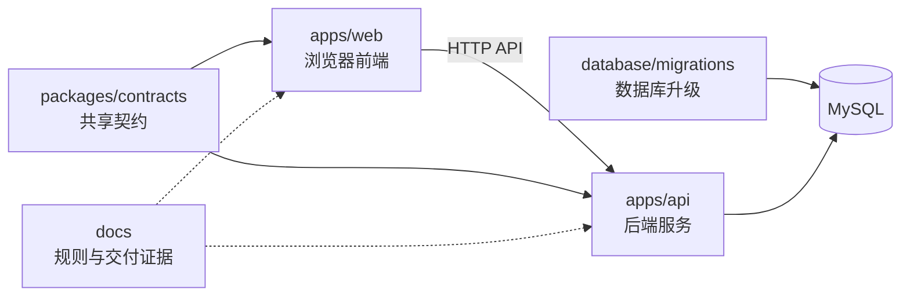

---

# 2. `apps/web` 前端逐文件说明

`apps/web` 是浏览器端独立应用。它只负责界面展示、用户交互、前端状态和调用 API，不负责最终权限裁决、数据库事务或库存过账。它与同级 `apps/api` 的关系是客户端与服务端：`web` 通过 `src/api.ts` 请求 `api`，不能直接访问 MySQL。

前端之所以独立成一个应用，是因为浏览器界面与后端业务的运行环境、发布方式和安全责任不同。把前端直接写进后端并非完全不可行，但会导致页面构建、接口发布和后端服务相互绑死，也容易让前端误以为自身校验就是最终业务校验。

## 2.1 `apps/web` 根目录

这一层只放“如何构建和启动前端”的工程文件，不放具体业务页面。业务代码统一进入 `src`，从而把工程配置与业务实现隔离。

- `Dockerfile`：定义前端容器的安装、构建和运行方式。
- `index.html`：浏览器加载 Vue 应用的 HTML 入口。
- `package.json`：前端依赖、启动、构建、测试和类型检查命令。
- `tsconfig.json`：前端 TypeScript 配置。
- `vite.config.ts`：Vite 开发服务器、构建、路径别名和接口代理配置。

## 2.2 `apps/web/src` 根目录

`src` 是前端源码根目录。根文件只承担应用启动、路由、全局请求和全局样式；可以独立归类的业务内容必须进入子目录。`views` 负责页面，`components` 负责可组合界面块，`stores` 负责跨页面状态，`utils` 负责纯计算，`assets` 负责静态资源，`styles` 负责视觉规则；`presentation` 原计划承载展示 Schema，但当前只是未正式接入页面的试点。

这些子目录处于同一前端应用内，但职责不是平级替代关系：路由先进入 `views`，页面再组装 `components`，两者都可以读取 `stores`、调用 `utils` 和使用 `styles/assets`。当前正式页面的字段配置主要位于 `views/business/configs`；`presentation` 只是尚未正式接入页面的库存盘点 Schema 试点，不能把它描述成全系统已经采用的正式能力。必须拆分的原因是它们变化来源不同：页面随业务流程变化，组件随复用场景变化，Store 随全局状态变化，工具随计算规则变化，样式随视觉规范变化。如果全部放在 `views`，页面会同时承担状态、计算、视觉和复用职责，最终形成无法安全修改的大文件。

### `src` 第一层完整能力提供关系图

这张图只展开打开 `apps/web/src` 后立即看到的第一层内容：7 个子文件夹和 6 个独立文件全部纳入，不继续展开子文件夹内部。实线表示运行时能力最终如何组成用户界面，虚线表示编译期支持或当前尚未正式接入的试点关系。箭头从“能力提供方”指向“能力使用方”。

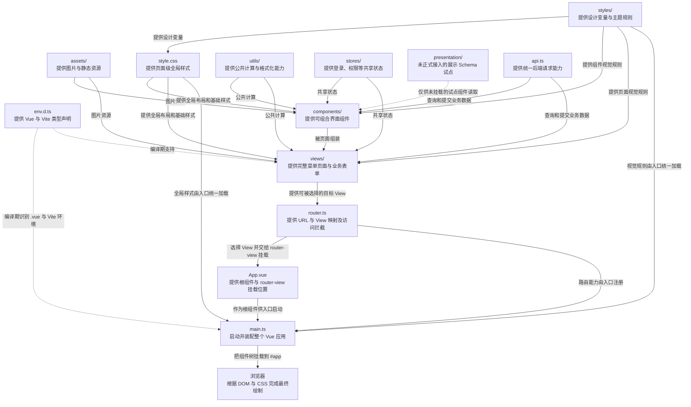

第一层各独立文件的具体职责和关系如下：

- `main.ts`：整个前端程序的唯一启动入口。它创建 Vue 应用，把 `App.vue` 作为根组件，注册 Pinia、`router.ts` 和 Element Plus，并一次性加载 Element Plus 样式、`styles/tokens.css` 与 `style.css`，最后把应用挂载到浏览器 `#app` 节点。它负责“把能力装起来”，不应该写采购、库存等业务逻辑。
- `App.vue`：整个系统最外层的 Vue 根组件。当前内容只有 `<router-view />`，作用是为 `router.ts` 当前匹配到的 View 留下挂载位置。它不决定具体打开哪个页面，也不承担页面业务。
- `router.ts`：系统的页面导航总表。它把 URL 映射到 `views` 中的页面组件，定义 Layout 下的各个菜单页面，并执行登录状态、菜单访问范围和页面标题等路由级处理。它提供“去哪里、能不能进入”的能力，但页面内部按钮和字段仍由具体 View 负责。
- `api.ts`：前端访问后端的统一通道。它创建 Axios 实例，统一使用 `/api` 前缀，自动携带登录 Token，提取正常响应数据，并集中处理 401 退出登录和接口错误提示。View、Form 或专项 Component 可以调用它，但不应该各自重复创建另一套请求规则。
- `style.css`：全局基础样式和通用页面样式。它定义页面容器、标题区、面板、统计区、按钮与其他跨页面公共外观；`main.ts` 只加载一次，之后这些规则会作用于整个组件树。它与 `styles/` 的区别是：`styles/` 主要保存可复用的设计变量和主题规则，`style.css` 主要把这些变量落实为实际 DOM 样式。
- `env.d.ts`：TypeScript 编译期声明文件。它让编辑器和构建工具认识 Vite 环境以及 `*.vue` 文件的模块类型，解决的是“代码能否被正确理解和检查”，不会在浏览器中提供按钮、页面或业务数据。它是开发基础设施，不是运行时业务模块。

因此，`src` 第一层可以按三层理解：`main.ts + App.vue + router.ts` 分别负责启动应用、提供页面挂载位置、选择目标 View 与拦截访问；`views + components + stores + utils + api.ts` 负责组成可运行的业务页面；`styles + style.css + assets` 只提供视觉规则和资源，不负责选择或创建业务页面；最终真正根据 DOM 与 CSS 进行布局和绘制的是浏览器。`env.d.ts` 在编译期支撑整套代码；`presentation` 当前只是孤立试点，尚未成为正式页面链路的一部分。

## 2.3 `apps/web/src/assets`

`assets` 只存由构建工具打包的图片等静态资源。它与 `styles` 的区别是：`assets` 是文件资源，`styles` 是界面规则；与 `components` 的区别是它本身没有交互逻辑。

- `huasu-logo.png`：系统 Logo。
- `login-business-bg.png`：登录页背景图。

## 2.4 `apps/web/src/components`

`components` 存放不能独立作为菜单页面、但可以被页面或其他组件组合使用的 Vue 界面单元。这里的“组件”更准确地说是“可组合”，不等于每个文件都必须被多个页面重复使用：根级组件面向跨模块复用，`business` 面向多种业务单据复用，领域组件只要求在本领域内边界清晰；某些组件目前可以只有一个调用方，但因自身字段、状态或交互足够独立而被拆出。真正只属于某个页面、没有独立职责、也不存在复用或单独测试价值的代码，不必为了形式强行放进 `components`，可以留在对应 Page 或 Form 中。

其内部子目录按“复用范围”拆分：根层文件跨多个模块使用，`business` 服务所有业务单据，`dashboard`、`inventory`、`production`、`purchase`、`requisition` 分别服务单一业务域。这些目录是并列领域，不互相直接调用；跨领域能力应上提到根层或 `business`。如果把所有组件平铺在一个目录，文件虽然仍能运行，但很难判断组件是否允许跨域复用，也容易让同名状态和业务术语混用。

### 学习图一：能力提供关系

这张图回答“完整页面由哪些能力组成”。箭头从能力提供方指向使用方，节点对应当前前端真实目录或入口文件；除了 Presentation、Components、Stores、Utils，还包括视觉资源、应用启动、路由以及前后端请求链。

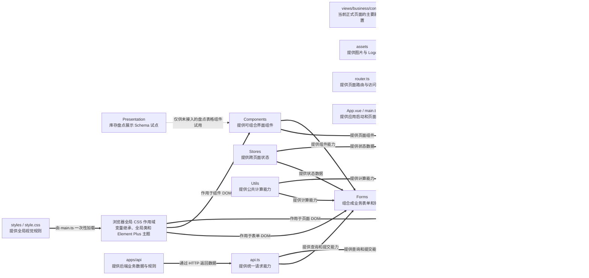

Styles 在这里不是三条逐级传递链，而是一套全局视觉规则被加载一次后，同时作用于 View、Form 和 Component。View 自己的页面结构直接使用全局类或 CSS 变量；Component 和 Form 的内部样式也可以引用同一套变量。Component/Form 后续被组装进 View 时，只是把已经受到统一规则约束的 DOM 一起带入完整页面，并不是再次把 Styles 转交给 View。

### 学习图二：代码调用关系

这张图回答“程序运行时谁导入、读取或调用谁”。箭头从调用方指向被调用方，因此同一对对象可能与上一张能力图方向相反：Component 向 View 提供能力，但源码中通常由 View 主动导入 Component。

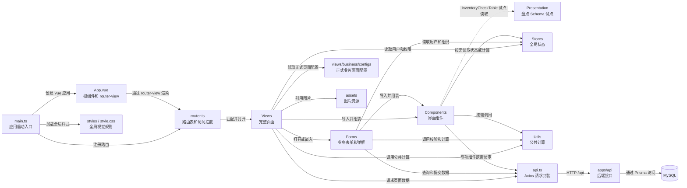

两张学习图必须配对阅读：第一张解释“能力怎样组成页面”，第二张解释“源码实际怎样依赖”。后面的细化拓扑继续使用相同对象，进一步展开到 `components` 子目录和具体文件。

### `components` 目录层级关系拓扑

下面这张图说明子目录之间的强组合关系：Component 是页面零件，Form 是由多个组件组成的业务表单，View 再把组件、Form 和页面配置组装成用户最终看到的完整页面。领域目录可以复用根级通用组件和 `business` 组件，但采购、库存、生产、领用等领域目录不能横向互相依赖。某项能力如果确实被多个领域长期复用，应上提到根级或 `business`，而不是从另一个领域目录借用。

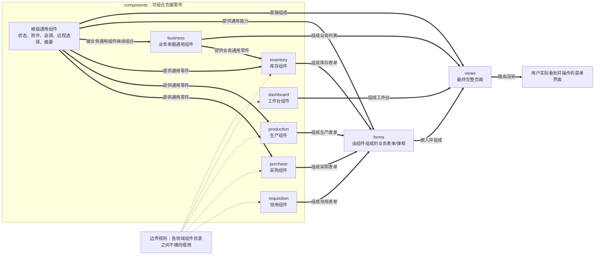

### `components` 关键文件组合关系拓扑

下面这张图进一步落到单文件，并统一采用产品视角的组合方向：箭头从较小的组件指向使用它的复合组件、Form 或 View，表示“这个组件最终被组装进右侧”。因此，沿箭头从左向右阅读，能够看到零件怎样逐级形成完整页面。虚线“验证”只表示测试关系，不表示界面组成关系。

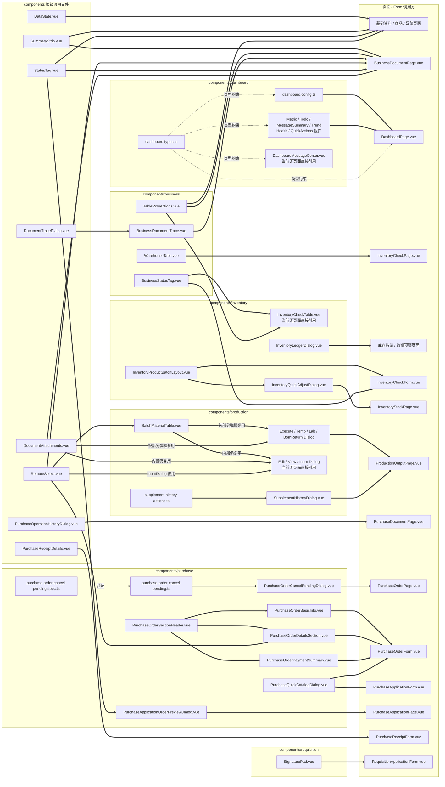

当前源码引用核对还显示：`DashboardMessageCenter.vue`、`InventoryCheckTable.vue` 以及生产目录中的 `EditOutboundDialog.vue`、`ViewOutboundDialog.vue`、`InputDialog.vue` 暂未被页面或 Form 直接导入。它们可能是尚待重新接回页面的能力，也可能是重构后遗留文件；这不等于可以直接删除，但后续审核时需要确认其真实去向。拓扑图将这类文件明确标为“当前无页面直接引用”，避免把“文件存在”误认为“功能已经接入”。

- `DataState.vue`：统一展示加载中、空数据和加载失败状态。
- `DocumentAttachments.vue`：单据附件上传、列表、删除和下载。
- `DocumentTraceDialog.vue`：单据上下游关系追溯弹框。
- `PurchaseOperationHistoryDialog.vue`：采购单据操作记录弹框。
- `PurchaseReceiptDetails.vue`：采购入库单明细展示。
- `RemoteSelect.vue`：输入关键字后调用 API 搜索选项的下拉组件。
- `StatusTag.vue`：根据状态和字典显示统一颜色标签。
- `SummaryStrip.vue`：列表页面顶部摘要统计。

## 2.5 `apps/web/src/components/business`

`business` 是采购、库存、生产、销售、领用都可复用的“业务单据基础组件”。它与同级 `purchase`、`inventory` 等目录的区别是：这里不包含某个业务独有字段，只表达所有业务表格或单据都可能需要的追溯、状态、操作列和仓库切换。

这里的文件按独立界面能力拆开，而不是组成一张固定页面：状态标签可以被列表调用，操作列可以被任意业务表格调用，追溯入口可以独立打开弹框，仓库页签可以单独控制查询范围。把它们合成一个“业务公共组件”也能显示页面，但调用方将被迫同时接收不需要的状态、操作和仓库逻辑，公共组件会迅速膨胀并重新成为全局大文件。

- `BusinessDocumentTrace.vue`：业务页面单据链路追溯入口。
- `BusinessStatusTag.vue`：业务单据状态标签。
- `TableRowActions.vue`：表格主操作按钮和“更多”菜单。
- `WarehouseTabs.vue`：按照仓库权限切换仓库数据。

## 2.6 `apps/web/src/components/dashboard`

`dashboard` 把工作台拆成可独立授权、独立加载和独立测试的组件。它与 `views/DashboardPage.vue` 的关系是“零件与组装页”：组件分别展示指标、待办、消息、快捷入口和趋势，页面根据角色配置选择并编排这些组件。

目录内的展示组件彼此并列，由 `DashboardPage.vue` 按角色返回的组件权限进行组装；`dashboard.config.ts` 当前集中定义快捷功能入口及其菜单、操作权限，`dashboard.types.ts` 为页面、快捷入口和所有工作台组件提供统一数据类型。工作台必须这样拆，是因为不同角色看到的组件组合不同；若全部写在 Dashboard Page 中，角色授权只能通过大量条件分支实现，任何一个卡片的加载失败也可能影响整个工作台。

- `DashboardHealthCard.vue`：系统或业务健康状态卡片。
- `DashboardMessageCenter.vue`：工作台消息中心完整内容。
- `DashboardMessageSummary.vue`：消息数量和未读摘要。
- `DashboardMetricCards.vue`：订单、库存、待办等指标卡片。
- `DashboardQuickActions.vue`：角色可用快捷功能入口。
- `DashboardTodoList.vue`：完整待办事项列表。
- `DashboardTodoPreview.vue`：待办摘要。
- `DashboardTrendCard.vue`：采购、库存、销售等趋势图。
- `dashboard.config.ts`：工作台快捷功能入口、目标路由及所需菜单和操作权限配置。
- `dashboard.types.ts`：工作台数据和组件配置类型。

## 2.7 `apps/web/src/components/inventory`

`inventory` 只存库存域可复用的复杂界面。之所以与业务表单分开，是因为盘点、库存查询和库存调整会共同使用商品—批次布局、库存流水等能力；若写进某一个 Form，其他页面只能复制代码。

这四个文件是“布局骨架—场景表格—业务弹框”的组合关系：`InventoryProductBatchLayout.vue` 只定义左右布局，`InventoryCheckTable.vue` 在布局中表达盘点数据，`InventoryQuickAdjustDialog.vue` 复用布局表达调整数据，`InventoryLedgerDialog.vue` 独立展示流水。它们不应合成一个文件，因为盘点、调整和流水的字段及提交方式不同；合并后会出现大量模式判断，修复盘点界面时容易破坏库存调整。

- `InventoryCheckTable.vue`：盘点商品和批次明细表格。
- `InventoryLedgerDialog.vue`：商品或批次库存流水弹框。
- `InventoryProductBatchLayout.vue`：左侧商品、右侧多批次通用布局。
- `InventoryQuickAdjustDialog.vue`：库存查询快速调整单品多批次库存弹框。

## 2.8 `apps/web/src/components/production`

`production` 按操作场景拆分生产弹框。生产出库页面同时包含正式领料、临时补料、实验室出库、退料和查看等多种交互，因此每种弹框独立成文件，`ProductionOutputPage.vue` 只负责组装，防止重新形成单个超大页面。

这些弹框共享生产单据上下文，但各自拥有独立触发条件、字段、校验和提交接口；`BatchMaterialTable.vue` 是多个弹框可复用的批次明细，`supplement-history-actions.ts` 是不带界面的操作规则。若全部写进 Production Output Page，一个页面需要同时维护多套表单状态和校验，关闭某个弹框时还可能污染另一弹框的数据，因此必须按操作场景拆开。

- `BatchMaterialTable.vue`：生产原料及批次库存明细。
- `BomReturnDialog.vue`：BOM 原料退回弹框。
- `EditOutboundDialog.vue`：编辑生产出库单弹框。
- `ExecuteOutDialog.vue`：执行生产原料出库弹框。
- `InputDialog.vue`：生产成品入库弹框。
- `LabOutboundDialog.vue`：实验室或特殊领料出库弹框。
- `SupplementHistoryDialog.vue`：生产补料历史弹框。
- `TempSupplementDialog.vue`：生产临时补料弹框。
- `ViewOutboundDialog.vue`：查看生产出库单弹框。
- `supplement-history-actions.ts`：补料历史可执行操作规则。

## 2.9 `apps/web/src/components/purchase`

`purchase` 存采购域可复用的弹框和表单分区。采购订单新增、编辑、查看共用基本信息、金额汇总和明细组件；差异由 `mode` 和权限控制，而不是复制三套界面。计算逻辑文件与视觉组件分开，使纯计算可以单独测试。

目录内文件形成两组关系：订单表单分区由 `PurchaseOrderForm.vue` 组装，独立业务弹框由采购申请页或采购订单页打开；纯函数 `purchase-order-cancel-pending.ts` 被退回弹框调用，同名 Spec 只验证计算。拆分的目的不是增加文件数量，而是让基本信息、商品明细、付款汇总和退回算法能够分别修改和测试。全部合并后，查看模式、新增模式、金额权限和退回逻辑会混在同一个组件中，任何修改都要回归整张采购订单。

- `PurchaseApplicationOrderPreviewDialog.vue`：采购申请整单或选品生成订单预览弹框。
- `PurchaseApplicationBasicInfo.vue`：采购申请的申请人、OA身份、成本承担组织、目标仓库和收货人三列基本信息分区。
- `PurchaseOrderBasicInfo.vue`：采购订单组织、仓库、部门、收货人和供应商信息。
- `PurchaseOrderCancelPendingDialog.vue`：退回采购订单未到货商品弹框。
- `PurchaseOrderDetailsSection.vue`：采购订单商品、SKU、数量和金额明细。
- `PurchaseOrderPaymentSummary.vue`：采购金额、付款、退款和待付款汇总。
- `PurchaseOrderSectionHeader.vue`：采购订单弹框分区标题。
- `PurchaseQuickCatalogDialog.vue`：快捷新增商品或补充 SKU 弹框。
- `purchase-order-cancel-pending.spec.ts`：测试未到货退回计算和校验。
- `purchase-order-cancel-pending.ts`：计算可退回数量并生成提交数据。

## 2.10 `apps/web/src/components/requisition`

`requisition` 存领用域专用组件。当前签名板只服务领用确认场景，因此不放在根级通用组件中，避免把业务专属语义伪装成全局能力。

当前目录只有一个文件，说明拆分不是为了机械增加层级，而是为了保留领域边界：签名板虽然视觉上可能被其他模块复用，但它当前绑定领用确认语义。未来若多个业务真正采用相同签名协议，才应抽到通用目录；现在提前上提反而会制造错误复用。

- `SignaturePad.vue`：领用出库或退回确认的手写签名组件。

## 2.11 `apps/web/src/presentation`、`stores` 与 `styles`

这三个同级目录的目标职责不同：`presentation` 计划承载独立展示 Schema，`stores` 保存跨页面共享状态，`styles` 定义界面视觉规则。但当前实现并不对称：Stores 和 Styles 已被全站使用，Presentation 只有库存盘点一个试点文件，尚未成为正式业务页面的统一展示来源；当前正式列表字段主要仍由 `views/business/configs` 提供。

在目标结构中，它们都可能被 View 或 Component 引用，但彼此不应形成循环依赖：展示 Schema 只描述字段，Store 管状态，Style 提供视觉变量。当前不能仅凭 Presentation 目录存在就认为全系统已经完成展示 Schema 抽取，后续必须在“继续推广 Presentation”与“统一回归 Business Config”之间选择一个唯一来源，避免同一页面维护两套列定义。

### `apps/web/src/presentation/schemas`

`schemas` 是 `presentation` 的叶子目录，设计目标是保存页面字段和列结构，不发请求、不保存状态。当前它只是试点目录，不是全系统已完成的架构层。

- `inventory-checks.ts`：库存盘点表格 Schema 试点；目前只被 `InventoryCheckTable.vue` 引用，而该组件没有被当前页面或 Form 直接挂载。正式库存盘点列表实际使用 `views/business/configs/inventory-check.ts` 中的 `columns`，因此两处存在重复字段定义和潜在不一致风险。

### `apps/web/src/stores`

`stores` 存 Pinia 全局状态。只有多个页面都需要、且生命周期跨路由的状态才进入这里；单个弹框的临时值仍应留在对应 Form 中。

- `auth.ts`：保存当前用户、Token、固定组织、角色、菜单、组织范围和金额白名单状态；登录页负责写入，路由、页面和权限工具共同读取，修改会影响全站身份与权限展示。

### `apps/web/src/styles`

`styles` 存全局视觉规范。它与组件内 `scoped style` 的关系是：全局文件定义统一变量和基础规则，组件只定义自身局部布局。

- `tokens.css`：系统颜色、字体、间距、圆角和阴影视觉变量；被全局样式和各组件引用，修改会同时影响多个页面的视觉风格。

## 2.12 `apps/web/src/utils`

`utils` 存无界面的公共函数。它与 `components` 的区别是：工具函数输入数据、返回结果，不渲染 UI；与 `stores` 的区别是它不长期保存状态。可独立验证的工具旁放同名 `spec.ts`，让实现与测试保持可追踪关系。

目录内各工具按一种计算规则一个文件拆分，测试文件只依赖对应实现；这些工具彼此通常没有调用顺序，页面或组件按需引用。理论上可以合成一个 `utils.ts`，但那会让批次号、组织树、商品仓库联动、权限和格式化这些完全不同的规则共同变化，测试也只能整体执行和定位，所以保持小文件更安全。

- `batch-number.spec.ts`：测试前端批次号处理。
- `batch-number.ts`：生成、解析和格式化批次号。
- `category-tree.spec.ts`：测试商品分类树。
- `category-tree.ts`：将商品分类转换为树形结构。
- `dictionary-cache.ts`：缓存数据字典，避免重复请求。
- `document-type.ts`：转换系统内部业务单据类型。
- `format.ts`：格式化日期、时间、金额和空值。
- `goods-warehouse.spec.ts`：测试商品分类与仓库类型匹配。
- `goods-warehouse.ts`：处理商品分类、仓库类型和仓库限制关系。
- `organization-tree.spec.ts`：测试组织树。
- `organization-tree.ts`：将组织数据转换成树形下拉结构。
- `permission.ts`：判断页面、菜单、按钮和业务操作权限。
- `random-id.spec.ts`：测试临时随机 ID。
- `random-id.ts`：为未写入数据库的数据生成临时 ID。
- `unit-name.spec.ts`：测试单位名称转换。
- `unit-name.ts`：将单位 ID 或字典值转换为单位名称。

## 2.13 `apps/web/src/views`

`views` 存可通过路由打开的完整页面。根层页面承载登录、布局、基础资料、商品、工作台、报表和系统管理等横向功能；采购、库存、生产、销售和领用等高密度业务页面继续下沉到 `views/business`，避免根目录混入几十个单据文件。

根层页面是路由入口，彼此并列，不应互相导入形成页面套页面；共享部分应进入 Components。`Layout.vue` 是例外，它作为外壳承载其他路由页面。将每个菜单拆成独立 Page 是为了让路由、访问权限、加载时机和故障边界独立；全部写入一个 Page 虽能通过条件切换显示，但会造成所有菜单一次性加载、权限分支交织和修改冲突。

- `CategoriesPage.vue`：商品分类管理页面。
- `DashboardPage.vue`：工作台数据总览、待办、消息和快捷功能总页面。
- `GoodsPage.vue`：商品、SKU 和商品基础信息管理页面。
- `InventoryGeneralPage.vue`：通用入库和通用出库页面。
- `Layout.vue`：左侧菜单、顶部账号信息和主内容布局。
- `Login.vue`：用户登录页面。
- `PropertiesPage.vue`：商品属性管理页面。
- `ReportPage.vue`：采购、库存、生产、销售和领用报表页面。
- `ResourcePage.vue`：组织、部门、职位、员工、仓库、供应商等基础资料通用页面。
- `ScheduledTaskPanel.vue`：定时任务配置、手动执行和运行记录面板。
- `SystemPage.vue`：角色、用户、菜单权限、系统配置和任务管理页面。
- `business-config.ts`：旧版业务列表配置，当前新业务引擎已基本不使用。

## 2.14 `apps/web/src/views/business`

`business` 是业务单据页面层。这里采用“通用引擎 + 薄页面 + 配置 + 表单”的结构：`BusinessDocumentPage.vue` 提供列表公共骨架，`XxxPage.vue` 只组装业务特例，`configs` 定义列表和按钮，`forms` 定义弹框字段和交互。选项加载与权限判断单独拆成组合函数，避免通用引擎继续膨胀。

这里不是几十个互不相关文件的平铺集合，而是一条固定组装链：路由进入某个薄 Page，Page 引用同名 Config，再把 Config 交给 `BusinessDocumentPage.vue` 渲染列表；需要新增、编辑、查看时，引擎打开同名 Form；Form 再组装领域 Component。`use-business-document-options.ts` 和 `use-business-document-permissions.ts` 分别向引擎提供选项与权限。拆开后，列表共性只改引擎，业务字段只改 Config，弹框交互只改 Form。若重新合并成一个通用大文件，任何模块的特殊逻辑都会进入全局条件分支，正是此前重构产生功能丢失的根源。

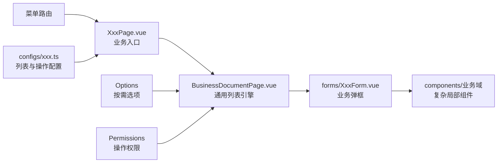

- `BusinessDocumentPage.vue`：业务单据共用查询、表格、分页、弹框和操作引擎。
- `InventoryAdjustmentPage.vue`：库存调整记录页面入口。
- `InventoryCheckPage.vue`：库存盘点页面入口及特殊交互。
- `InventoryExpiryAlertPage.vue`：库存效期预警页面入口。
- `InventoryLossOutputPage.vue`：报损出库单页面入口。
- `InventoryLossPage.vue`：库存报损申请页面入口。
- `InventoryOverflowInputPage.vue`：盘盈入库单页面入口。
- `InventoryOverflowPage.vue`：库存盘盈申请页面入口。
- `InventoryQuantityAlertPage.vue`：库存数量预警页面入口。
- `InventoryStockPage.vue`：库存查询、仓库切换、库存流水和快速调整页面。
- `InventoryTransferPage.vue`：库存调拨页面入口。
- `ProductionBomPage.vue`：BOM 管理页面入口。
- `ProductionInputPage.vue`：生产成品入库页面入口。
- `ProductionOutputPage.vue`：生产领料、补料和出库页面入口。
- `ProductionPlanPage.vue`：生产计划页面入口。
- `ProductionShortagePage.vue`：生产缺料清单页面入口。
- `PurchaseApplicationPage.vue`：采购申请页面入口及生成订单弹框组装。
- `PurchaseDocumentPage.vue`：在通用业务页上增加采购操作记录。
- `PurchaseOrderPage.vue`：采购订单页面入口及未到货退回弹框组装。
- `PurchasePaymentPage.vue`：采购付款页面入口。
- `PurchaseReceiptPage.vue`：采购入库页面入口。
- `PurchaseRefundPage.vue`：采购退款页面入口。
- `PurchaseReturnPage.vue`：采购退货页面入口。
- `RequisitionApplicationPage.vue`：领用申请页面入口。
- `RequisitionOutputPage.vue`：领用出库页面入口。
- `RequisitionReturnPage.vue`：领用退回页面入口。
- `SalesDiscountOrderPage.vue`：折价销售单页面入口。
- `SalesOrderPage.vue`：销售订单页面入口。
- `SalesOutputPage.vue`：销售出库单页面入口。
- `SalesPaymentPage.vue`：销售收款页面入口。
- `SalesRefundPage.vue`：销售退款页面入口。
- `SalesReturnPage.vue`：销售退货页面入口。
- `SalesServicePage.vue`：售后记录页面入口。
- `business-document-config.ts`：定义业务页面列、查询项、按钮和弹框配置类型。
- `use-business-document-options.ts`：按页面加载字典、组织、仓库和人员选项。
- `use-business-document-permissions.ts`：计算业务页面和按钮权限。

## 2.15 `apps/web/src/views/business/configs`

`configs` 是业务列表的声明层。每个文件与同名 Page、Form 一一对应，写列、筛选项、摘要、API 地址、按钮显示条件和权限，但不写复杂表单模板。测试文件也放在这里，是因为它们验证的正是配置层恢复了哪些按钮和字段。

这些 Config 文件相互并列，由各自 Page 使用，不允许一个业务配置直接修改另一个业务配置。多个配置可以复用 `business-document-config.ts` 定义的类型，但不能把所有业务配置合进一个巨大对象；否则修改采购按钮也需要加载和检查库存、生产、销售全部配置，合并冲突与误改范围都会扩大。Spec 与实现分开，是因为测试是验证者而不是运行配置，生产构建不会把测试当成页面逻辑执行。

- `inventory-adjustment.ts`：库存调整列表、筛选、按钮、API 和表单配置。
- `inventory-check.ts`：库存盘点列表、筛选、按钮、API 和表单配置。
- `inventory-expiry-alert.ts`：效期预警列表、筛选和查看配置。
- `inventory-loss-output.ts`：报损出库列表、按钮、API 和表单配置。
- `inventory-loss.ts`：报损申请列表、审核、API 和表单配置。
- `inventory-overflow-input.ts`：盘盈入库列表、确认、API 和表单配置。
- `inventory-overflow.ts`：盘盈申请列表、审核、API 和表单配置。
- `inventory-quantity-alert.ts`：数量预警列表、筛选和查看配置。
- `inventory-stock.ts`：库存查询字段和基础配置。
- `inventory-transfer.ts`：库存调拨列表、状态操作、API 和表单配置。
- `p1-restored-ui.spec.ts`：验证重构后 P1 页面字段和操作恢复。
- `p2-dialog-consistency.spec.ts`：验证业务弹框字段和布局一致性。
- `production-bom.ts`：BOM 列表、启停、API 和表单配置。
- `production-input.ts`：生产入库列表、确认和删除配置。
- `production-output.ts`：生产出库列表、办理、查看和删除配置。
- `production-plan.ts`：生产计划列表、库存判断、缺料和执行配置。
- `production-shortage.ts`：生产缺料列表、查看和生成采购申请配置。
- `purchase-application.ts`：采购申请列表、提交、删除和生成订单配置。
- `purchase-order.ts`：采购订单列表、付款、采购、入库和删除配置。
- `purchase-payment.ts`：采购付款列表、新增、删除和金额字段配置。
- `purchase-receipt-flow.spec.ts`：验证采购订单生成入库及入库流程。
- `purchase-receipt.ts`：采购入库列表、办理、确认、取消和查看配置。
- `purchase-refund.ts`：采购退款列表、登记、作废和关闭配置。
- `purchase-return.ts`：采购退货列表、提交、审核、删除和查看配置。
- `remaining-p0-actions.spec.ts`：验证剩余 P0 关键业务按钮。
- `requisition-application.ts`：领用申请列表、提交、删除和查看配置。
- `requisition-output.ts`：领用出库列表、办理、确认和查看配置。
- `requisition-return.ts`：领用退回列表、确认和查看配置。
- `sales-discount-order.ts`：折价销售列表、提交、审核和出库配置。
- `sales-order-actions.spec.ts`：测试销售订单生产计划和出库操作。
- `sales-order.ts`：销售订单列表、库存判断、生产计划和出库配置。
- `sales-output.ts`：销售出库列表、办理和确认配置。
- `sales-payment.ts`：销售收款列表和查看配置。
- `sales-refund.ts`：销售退款列表和查看配置。
- `sales-return.ts`：销售退货列表、办理和确认配置。
- `sales-service.ts`：售后记录列表、处理和查看配置。

## 2.16 `apps/web/src/views/business/forms`

`forms` 是业务弹框层。每个文件负责一种单据的新增、编辑、查看数据加载、字段联动、校验和提交。它与 `configs` 的关系是：配置决定“何时打开、标题和按钮”，表单决定“弹框内部如何工作”；与 `components/<domain>` 的关系是：表单负责整体编排，可重复的复杂局部继续拆成领域组件。

每种业务单据必须拥有独立 Form，是因为字段、状态流转、接口和校验不同。新增、编辑、查看可以在同一个业务 Form 内通过明确的 `mode` 复用，是因为它们围绕同一份单据结构；但采购订单 Form 与库存盘点 Form 不能合并，它们没有共同业务生命周期。若把所有弹框塞进 `BusinessDocumentPage.vue`，通用引擎就必须理解每张单据，最终无法判断一次修改影响哪些菜单。

- `InventoryAdjustmentForm.vue`：新增、编辑和查看库存调整单。
- `InventoryCheckForm.vue`：创建盘点单并录入商品多批次实盘数量。
- `InventoryExpiryAlertForm.vue`：查看效期预警详情。
- `InventoryLossForm.vue`：新增、编辑和查看库存报损申请。
- `InventoryLossOutputForm.vue`：办理和查看报损出库单。
- `InventoryOverflowForm.vue`：新增、编辑和查看盘盈申请。
- `InventoryOverflowInputForm.vue`：办理和查看盘盈入库单。
- `InventoryQuantityAlertForm.vue`：查看数量预警详情。
- `InventoryStockForm.vue`：查看库存商品详情。
- `InventoryTransferForm.vue`：新增、编辑和查看库存调拨单。
- `ProductionBomForm.vue`：新增、编辑和查看 BOM 及原料明细。
- `ProductionInputForm.vue`：办理和查看生产成品入库。
- `ProductionOutputForm.vue`：新增、编辑和查看生产出库单。
- `ProductionPlanForm.vue`：新增、编辑和查看生产计划。
- `PurchaseApplicationForm.vue`：新增、编辑、查看和提交采购申请。
- `PurchaseOrderForm.vue`：新增、编辑和查看采购订单并编排子组件。
- `PurchasePaymentForm.vue`：登记和查看采购付款。
- `PurchaseReceiptForm.vue`：办理采购入库、填写批次、确认和查看。
- `PurchaseRefundForm.vue`：登记、查看和处理采购退款。
- `PurchaseReturnForm.vue`：新增、提交和查看采购退货。
- `RequisitionApplicationForm.vue`：新增、编辑和查看领用申请。
- `RequisitionOutputForm.vue`：办理、确认和查看领用出库。
- `RequisitionReturnForm.vue`：新增、确认和查看领用退回。
- `SalesDiscountOrderForm.vue`：新增、提交和查看折价销售单。
- `SalesOrderForm.vue`：查看和维护销售订单信息。
- `SalesOutputForm.vue`：办理和查看销售出库。
- `SalesPaymentForm.vue`：查看销售收款数据。
- `SalesRefundForm.vue`：查看销售退款数据。
- `SalesReturnForm.vue`：办理和查看销售退货。
- `SalesServiceForm.vue`：新增、编辑、查看售后记录和处理进展。
- `ShortageViewForm.vue`：查看生产缺料清单详情。

---

# 3. `apps/api` 后端逐文件说明

`apps/api` 是独立后端服务。它负责身份校验、最终权限、业务规则、事务、数据库和外部接口。它与 `web` 同级而不是其子目录，是为了保证前端不能绕过 API 直接改数据库，也使后端可以被OA、商城或其他客户端复用。

## 3.1 `apps/api` 根目录与 Prisma

根层工程文件定义后端如何构建和测试；`src` 放运行代码；`prisma` 放当前数据库模型。`schema.prisma` 只表达最终结构，数据库升级步骤仍放在项目根目录 `database/migrations`，两者不能混为一份文件。

`src` 内部按业务域和技术能力拆成多个同级模块：采购、库存、生产、销售、领用是业务域；认证、金额权限、数据库、消息、附件、编号是跨业务能力；`integrations` 是外部系统边界；`scripts` 是人工工具。`app.module.ts` 只负责把这些模块装配起来，`main.ts` 只负责启动。模块之间通过公开 Service 协作，不应读取对方目录中的私有实现。全部放在 `app.module.ts` 或单个 Service 中仍可能运行，但权限、事务、外部接口和业务规则会无法隔离，也无法单独测试或替换。

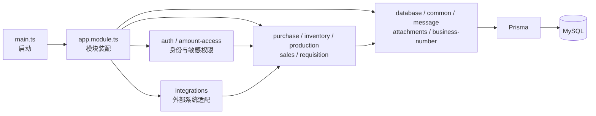

- `Dockerfile`：后端容器安装、构建和启动方式。
- `package.json`：后端依赖、启动、测试、Prisma 和构建命令。
- `tsconfig.build.json`：后端正式构建 TypeScript 配置。
- `tsconfig.json`：后端开发和类型检查配置。
- `vitest.config.ts`：后端 Vitest 测试配置。
- `prisma/schema.prisma`：当前 MySQL 全部表、字段、索引和关系。
- `src/app.module.ts`：装配全部后端模块。
- `src/main.ts`：启动 NestJS 并配置 API 前缀、跨域、校验、日志和异常处理。

## 3.2 `amount-access`

`amount-access` 是独立于 RBAC 和组织范围的敏感金额权限模块。单独设立是为了让金额白名单可以独立维护，并在所有采购、库存、销售接口统一脱敏；Decorator 声明要求，Service 计算权限，Interceptor 处理返回字段，Registry 集中登记敏感字段，测试分别验证服务和拦截结果。

这些文件组成“声明—判断—执行—字段清单—装配—测试”链路：Controller 使用 Decorator 声明要求，请求或响应进入 Interceptor，Interceptor 调用 Service 判断用户权限，再按 Registry 处理字段，Module 将整套能力注册。可以把它们合成一个文件，但会让注解、权限查询和递归脱敏无法分别复用与测试；更严重的是金额字段清单可能散落到各业务模块，造成漏脱敏。

- `amount-access.decorator.ts`：声明接口必须具备金额编辑权限。
- `amount-access.interceptor.spec.ts`：测试金额脱敏拦截器。
- `amount-access.interceptor.ts`：API 返回前隐藏无权查看的金额字段。
- `amount-access.module.ts`：注册金额权限模块。
- `amount-access.service.spec.ts`：测试金额白名单和权限判断。
- `amount-access.service.ts`：读取用户金额权限并执行字段脱敏。
- `amount-field-registry.ts`：集中登记敏感金额字段。

## 3.3 `attachments`

`attachments` 统一处理所有业务单据附件。它不属于采购或库存任何一个业务域，因为多种单据都需要相同的上传、关联、下载和删除规则；Controller 提供接口，Service 管理存储与业务关系，Module 提供给其他模块引用。

Controller、Service、Module 和 Spec 是 NestJS 模块的标准分工：Controller 只处理 HTTP，Service 只处理附件业务，Module 负责依赖装配，Spec 验证 Service。技术上可以写在一个文件，但接口协议、存储实现和装配会相互耦合，后续更换对象存储时容易误改路由或权限。

- `attachments.controller.ts`：附件上传、查询、删除和下载 API。
- `attachments.module.ts`：注册附件模块。
- `attachments.service.spec.ts`：测试附件业务。
- `attachments.service.ts`：处理附件存储、业务关联和删除。

## 3.4 `auth`

`auth` 负责“谁可以进入系统、可以调用什么接口”。它与 `amount-access` 的关系是基础访问权与敏感字段权叠加；与 `database/data-scope` 的关系是 Auth 计算用户身份和权限，Data Scope 把组织范围带入数据库请求。Guard 做入口拦截，Decorator 做声明，Service 做认证，类型文件定义身份结构。

认证目录必须拆成多类文件，因为它们执行时机不同：登录时由 Controller 和 Auth Service 工作，请求进入时由 Auth Guard 校验身份，再由 Permission Guard 校验菜单动作，Controller 通过 Current User Decorator 读取身份；Permissions Decorator 只声明所需权限，Request Permission 负责计算结果。若全部写在 Auth Service 中，框架无法在不同阶段独立调用，登录、菜单权限、组织范围和金额权限也会被错误混为一个判断。

- `auth.controller.ts`：登录、当前用户和密码 API。
- `auth.guard.ts`：拦截无有效 Token 请求。
- `auth.module.ts`：注册认证和权限服务。
- `auth.service.ts`：校验账号密码、签发 Token 和加载用户身份。
- `auth.types.ts`：登录用户、Token 和权限类型。
- `current-user.decorator.ts`：在 Controller 中取得当前用户。
- `permission.guard.spec.ts`：测试菜单和操作权限守卫。
- `permission.guard.ts`：执行接口菜单和操作权限校验。
- `permissions.decorator.ts`：声明接口所需权限。
- `request-permission.spec.ts`：测试请求权限和组织范围。
- `request-permission.ts`：计算角色、菜单、操作和组织最终权限。

## 3.5 `base-data`

`base-data` 统一承载组织、部门、职位、员工、仓库、供应商、客户等主数据。它与 `goods` 同级：Goods 专门处理商品复杂结构，Base Data 处理其余通用基础资料。Config 描述不同资料的表和字段差异，Controller 和 Service 复用这一配置，避免每类资料重复一整套文件。

这里既没有为每类基础资料复制一套 Controller，也没有把所有差异硬编码进 Service，而是用 Config 描述差异、Service 执行通用规则、Controller 暴露统一接口、Module 装配、Spec 验证。完全不拆会让几十类资料的表名、字段和校验散落在路由代码；过度拆成几十个模块又会产生大量重复，因此当前结构是在复用与清晰度之间的折中。

- `base-data.config.ts`：基础资料表、字段和查询方式配置。
- `base-data.controller.ts`：组织、部门、职位、员工、仓库和供应商 API。
- `base-data.module.ts`：注册基础资料模块。
- `base-data.service.spec.ts`：测试基础资料查询和维护。
- `base-data.service.ts`：基础资料列表、选项和增删改逻辑。

## 3.6 `business-number`

`business-number` 是所有业务域共享的单号生成器。独立设立是为了统一格式并保证并发下不重复；业务模块只申请某种编号，不应自行拼接采购单号或库存单号。

Constants 只定义编号类型和格式，Service 负责并发生成，Module 提供注入，Spec 验证唯一性。四个文件内容不多，但变化原因不同：新增编号类型不应触碰并发实现，修改生成算法不应修改模块装配。若每个业务 Service 自行生成单号，短期文件更少，长期会产生格式不一致和重复编号风险。

- `business-number.constants.ts`：业务单号类型和格式常量。
- `business-number.module.ts`：注册业务编号服务。
- `business-number.service.spec.ts`：测试编号生成和并发安全。
- `business-number.service.ts`：统一生成业务单号。

## 3.7 `common`

`common` 只放全后端都可复用且没有具体业务归属的技术能力，包括统一返回、异常、序列化、分页、日志和编码工具。`dto` 细分请求数据结构，`logger` 细分日志实现。具体采购或库存规则不能放进 Common，否则会丢失业务边界。

Common 内文件大多彼此并列，由 `main.ts` 或各模块按需调用；只有 `dto` 和 `logger` 因类型与实现特点继续分目录。它们不能合成一个“万能公共文件”，因为响应包装、异常处理、批次号、分页和日志没有共同生命周期。公共目录越大越需要严格限制边界，否则任何无法归类的代码都会被塞进来，最终形成新的技术债中心。

- `api.interceptor.spec.ts`：测试统一 API 成功返回格式；与 `api.interceptor.ts` 配套，防止前端依赖的响应外壳被无意改变。
- `api.interceptor.ts`：统一包装 Controller 返回值；所有业务 Controller 的正常结果经过这里后形成一致的状态码、消息和数据结构。
- `batch-number.spec.ts`：测试后端批次号规则；约束 `batch-number.ts` 的生成和规范化结果。
- `batch-number.ts`：生成和规范化库存批次号；供库存、采购入库和生产入库服务调用，本身不写数据库。
- `http-exception.filter.ts`：统一捕获业务异常和系统异常并转换为 API 错误返回；与成功响应拦截器共同形成完整接口协议。
- `query-code.spec.ts`：测试查询编码规则。
- `query-code.ts`：生成和规范化查询编码；供需要稳定查询标识的服务复用。
- `serialize.ts`：处理 BigInt、日期等 JSON 序列化；避免 Prisma 数据直接返回浏览器时出现类型错误。

### `common/dto`

`dto` 是公共请求数据结构叶子目录，只放多个 Controller 都能使用的参数定义；业务专属 DTO 应留在对应业务目录，避免公共层依赖具体业务。

- `pagination.dto.ts`：定义页码、每页数量等通用分页参数；多个列表 Controller 复用，最终由 Service 转为数据库分页查询。

### `common/logger`

`logger` 是日志实现叶子目录。单独拆出是因为日志包含文件输出、格式、级别和异常栈等技术细节，和返回拦截、分页 DTO 等其他 Common 能力变化原因不同。

- `winston-logger.ts`：封装系统运行日志和错误日志；由后端启动入口注册，业务模块通过统一日志接口使用而不直接关心文件输出方式。

## 3.8 `dashboard`

`dashboard` 负责工作台聚合数据。它读取采购、库存、消息等多个域，但不修改这些业务单据；单独设立是为了避免把跨域统计塞进任一业务 Service。Controller 提供组件接口，Service 按角色和组织范围聚合，测试验证数据范围。

工作台是“只读聚合模块”，与采购、库存等源模块是读取关系而不是所有权关系。Controller、Service、Module、Spec 分开，使接口、聚合算法、装配和测试独立。如果把工作台统计写入采购或库存 Service，其他模块的数据会反向依赖某一个业务域，角色组件和组织范围也难以统一执行。

- `dashboard.controller.ts`：工作台指标、待办、消息和快捷功能 API。
- `dashboard.module.ts`：注册工作台模块。
- `dashboard.service.spec.ts`：测试角色组件和组织范围统计。
- `dashboard.service.ts`：按角色和组织权限统计工作台数据。

## 3.9 `database`

`database` 是业务模块与 Prisma 之间的公共基础层。Prisma Service 管连接，Data Scope 管当前请求组织范围，Master Data 管公共主数据，Reference 管单据引用，Todo 管待办。它与各业务 Service 的关系是提供可复用数据库能力，但不会代替业务模块决定状态流转。

这里的子能力都访问数据库，但不能因此合成一个 Database Service：连接生命周期、请求组织上下文、主数据查询、单据引用和待办分别由不同调用方使用，也需要不同测试。Prisma Service 是最底层，其余服务可以依赖它；业务 Service 可以依赖这些公共服务；反向依赖禁止，否则数据库基础层会知道采购或销售的具体流程并形成循环引用。

- `business-master-data.service.spec.ts`：测试公共主数据读取。
- `business-master-data.service.ts`：统一读取组织、仓库、商品和人员主数据。
- `business-reference.service.ts`：查询业务单据引用和上下游关系。
- `data-scope.context.ts`：保存当前请求组织数据范围。
- `data-scope.interceptor.ts`：把登录用户数据范围写入请求上下文。
- `database.module.ts`：注册 Prisma 和数据库公共服务。
- `prisma.service.spec.ts`：测试 Prisma 连接和扩展逻辑。
- `prisma.service.ts`：建立 MySQL 连接并提供 Prisma 客户端。
- `todo.service.spec.ts`：测试待办创建、更新和关闭。
- `todo.service.ts`：统一创建和维护业务待办。

## 3.10 `document-trace`

`document-trace` 只负责读取和展示业务单据上下游关系，不创建或修改采购、库存等业务单据。独立设立后，各业务模块只负责写入标准关系，追溯模块负责统一查询。

该目录采用 Controller、Service、Module 三文件，是因为 HTTP 入口、关系组装和依赖注册属于三个框架职责。文件数量虽少，仍不应并入采购模块：追溯链会同时跨采购、库存、生产、销售和领用，归入任何单一业务域都会造成其他业务反向依赖它。

- `document-trace/document-trace.controller.ts`：单据追溯 API。
- `document-trace/document-trace.module.ts`：注册单据追溯模块。
- `document-trace/document-trace.service.ts`：读取关系表并组装业务链路。

## 3.10.1 `goods`

`goods` 是商品主数据领域，管理商品、分类、属性和 SKU。它与 `base-data` 同级，是因为商品具有独立的分类、属性和多 SKU 结构，不能被压缩成普通基础资料配置。

Goods 使用 Controller、Service、Module、Spec 的标准组合。商品、分类、属性和 SKU 目前由同一 Service 管理，是因为它们属于同一聚合且经常需要同一事务；若后续 Service 继续膨胀，可再按分类树、SKU 和商品主体拆子服务。直接并入 Base Data 虽能少一个目录，却会迫使通用基础资料引擎理解商品多层关系，降低两边可维护性。

- `goods/goods.controller.ts`：商品、分类、属性和 SKU API。
- `goods/goods.module.ts`：注册商品模块。
- `goods/goods.service.spec.ts`：测试商品和 SKU 规则。
- `goods/goods.service.ts`：商品、分类、属性和 SKU 业务逻辑。

## 3.10.2 `health`

`health` 提供无业务副作用的运行状态检测，供部署平台判断 API 和数据库是否可用。它不依赖普通业务 Controller，因此单独成最小目录。

当前只有一个 Controller，说明目录拆分不是机械套用模板：没有独立复杂业务就不强行创建 Service 和 Module。它单独成目录是为了不把部署探针混入业务接口；若健康检查未来增加外部系统和缓存检测，再拆 Service 才有价值。

- `health/health.controller.ts`：服务和数据库健康检查。

## 3.10.3 `message`

`message` 管用户可见的系统消息。它与 `database/todo.service.ts` 的区别是：Message 面向通知阅读，Todo 面向需要执行的任务；业务模块可以同时创建二者，但二者生命周期不同。

Message Service 负责消息创建、查询和已读状态，Module 提供给业务模块注入，Spec 验证行为。没有独立 Controller 是因为当前消息接口由工作台或其他入口聚合。不能因为消息和待办经常同时生成就合并：消息读完即可，待办必须跟踪责任人和完成状态，强行共表或共服务会混淆生命周期。

- `message/message.module.ts`：注册消息模块。
- `message/message.service.spec.ts`：测试消息生成、读取和已读状态。
- `message/message.service.ts`：创建和查询业务消息。

## 3.10.4 `redis`

`redis` 封装缓存或分布式辅助能力，避免业务 Service 直接创建 Redis 客户端。它与 `database` 同级：Database 管持久化 MySQL，Redis 管临时缓存状态。

当前 Module 负责连接装配，Service 负责缓存读写，因此只需两个文件。它们不能直接并入 Prisma Service，因为 Redis 数据可丢失、MySQL 数据需持久保存，两者一致性和故障策略不同；业务模块只依赖抽象服务，不应自行管理连接。

- `redis/redis.module.ts`：注册 Redis 模块。
- `redis/redis.service.ts`：Redis 连接和缓存能力。

## 3.11 `inventory`

`inventory` 是库存业务域。Controller 区分核心库存 API 与通用出入库 API；Service 管单据，Posting Service 成为唯一库存增减执行入口，Alert Service 管预警，OA Service 管审批，Helpers 和 Dictionary 管纯计算与字典。拆开这些文件是为了防止“单据管理、实际过账、预警、审批”互相污染。

库存目录内部存在明确调用方向：两个 Controller 接收不同入口请求，分别调用 Inventory Service 或 General Service；这些单据服务在需要真正增减库存时统一调用 Posting Service；Alert Service 只读取库存计算预警；OA Service 只处理外部审批；Helpers 和 Dictionary 为上述服务提供无状态规则。Spec 与对应 Service 成对。若全部合进 `inventory.service.ts`，查询、单据保存、库存过账、预警和 OA 会共享大量状态分支，最危险的后果是普通编辑操作可能误触发实际库存增减，因此 Posting 必须独立。

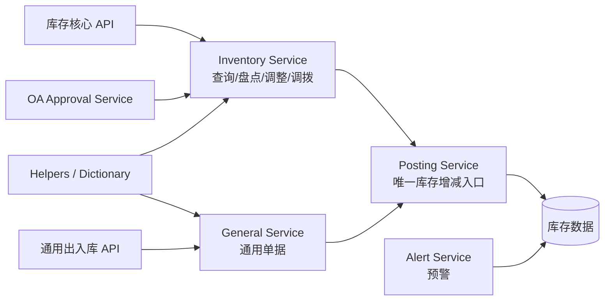

- `inventory-alert.service.spec.ts`：测试数量和效期预警。
- `inventory-alert.service.ts`：计算数量和效期预警。
- `inventory-dictionary.ts`：库存业务字典代码和转换。
- `inventory-general.controller.ts`：通用入库和出库 API。
- `inventory-general.service.spec.ts`：测试通用出入库。
- `inventory-general.service.ts`：保存、确认和撤销通用出入库单。
- `inventory-helpers.ts`：库存数量、批次和状态公共计算。
- `inventory-oa-approval.service.ts`：库存相关 OA 审批。
- `inventory-posting.service.spec.ts`：测试库存增减、幂等和防重复过账。
- `inventory-posting.service.ts`：统一执行库存增减和流水。
- `inventory.controller.ts`：库存查询、盘点、调整、调拨、报损和盘盈 API。
- `inventory.module.ts`：注册库存模块。
- `inventory.service.spec.ts`：测试库存核心业务。
- `inventory.service.ts`：库存查询、调整、盘点、调拨、报损和盘盈逻辑。

## 3.12 `production`

`production` 管 BOM、生产计划、缺料、领料和成品入库。它与库存模块协作完成原料扣减和成品增加，与采购模块通过缺料清单生成采购申请；OA 审批独立成 Service，避免外部审批协议进入生产核心逻辑。

生产 Controller 调用 Production Service，Production Service 编排 BOM、计划和缺料，并通过 Inventory Posting 完成原料及成品变动；OA Service 只负责审批通信，Module 负责装配，两个 Spec 分别验证核心链路和 OA 边界。当前核心 Service 仍偏大，但不能为了减少文件把 OA 再合回去；后续应继续按 BOM、计划、缺料和出入库拆子服务，而不是反向集中。

- `production-oa-approval.service.spec.ts`：测试生产 OA 审批。
- `production-oa-approval.service.ts`：提交生产单据到 OA 并处理结果。
- `production.controller.ts`：BOM、生产计划、出入库和缺料 API。
- `production.module.ts`：注册生产模块。
- `production.service.spec.ts`：测试生产和库存联动。
- `production.service.ts`：BOM、计划、缺料、领料和成品入库逻辑。

## 3.13 `purchase`

`purchase` 管采购申请、拆单订单、入库、退货、付款和退款。Controller 是接口入口，主 Service 管事务，Lifecycle 单独计算订单综合状态，两个 OA Service 分别处理采购申请和采购退货审批。它与 Inventory 通过入库和退货过账协作，与 Message/Todo 同步收货和付款待办。

采购内部关系是：Controller 接收页面请求；Purchase Service 编排申请、订单、入库、退货和金额业务；Lifecycle 只根据到货、退回和付款结果计算订单状态；两个 OA Service 分别处理不同表单协议；Module 装配；Spec 验证核心链路和纯状态计算。Lifecycle 必须脱离主 Service，才能在历史回填、订单操作和测试中复用同一口径。全部合并虽然文件更少，但采购申请审批、退货审批、库存过账和付款状态会交织，修复一个状态极易破坏其他链路。

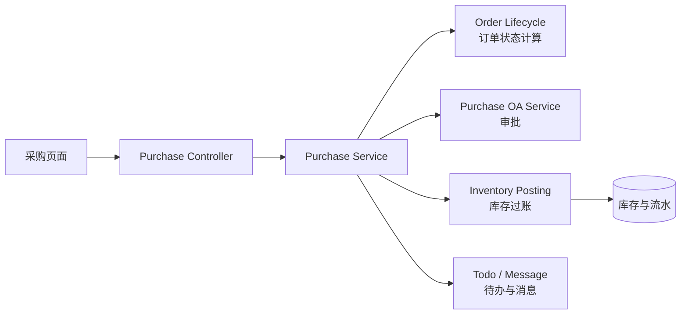

- `purchase-oa-approval.service.spec.ts`：测试采购申请 OA 审批。
- `purchase-oa-approval.service.ts`：提交采购申请到 OA 并处理结果。
- `purchase-order-lifecycle.spec.ts`：测试采购订单生命周期。
- `purchase-order-lifecycle.ts`：计算到货、退回、付款和完成状态。
- `purchase-return-oa-approval.service.ts`：采购退货 OA 审批。
- `purchase.controller.ts`：采购申请、订单、入库、退货、付款和退款 API。
- `purchase.module.ts`：注册采购模块。
- `purchase.service.spec.ts`：测试采购完整链路。
- `purchase.service.ts`：采购申请、拆单、订单、入库、退货、付款和退款逻辑。

## 3.14 `requisition`

`requisition` 管员工领用申请、仓库出库和领用退回。核心 Service 与库存过账协作，OA Service 负责审批提交，Callback Controller 专门接收外部结果。回调入口与普通业务 Controller 分开，是为了明确外部系统调用边界和验签要求。

普通 Controller 服务已登录用户，Callback Controller 服务 OA 外部回调，两者鉴权方式完全不同；核心 Service 管领用业务，OA Service 管提交协议，Module 装配，对应 Spec 分别验证业务、提交和回调。若将回调写进普通 Controller，容易错误复用用户 Token 权限或放宽内部接口；若将 OA 协议写进 Requisition Service，外部接口字段变化会直接影响领用库存逻辑。

- `requisition-oa-approval.service.spec.ts`：测试领用 OA 审批。
- `requisition-oa-approval.service.ts`：提交领用单据到 OA 并处理结果。
- `requisition-oa-callback.controller.spec.ts`：测试领用 OA 回调。
- `requisition-oa-callback.controller.ts`：接收领用审批回调。
- `requisition.controller.ts`：领用申请、出库和退回 API。
- `requisition.module.ts`：注册领用模块。
- `requisition.service.spec.ts`：测试领用和库存联动。
- `requisition.service.ts`：领用申请、出库和退回逻辑。

## 3.15 `sales`

`sales` 管销售订单、出库、退货、收退款、折价销售和售后。`dto` 目录把可校验的请求结构从 Controller 中拆出，Helpers 承载纯计算，OA Service 处理折价审批，Aftersales Controller 提供外部售后入口，主 Controller/Service 处理内部业务。

销售内部调用方向为：内部页面进入 Sales Controller，外部商城售后进入 Aftersales Integration Controller，两者最终调用 Sales Service；Service 使用 Helpers 计算状态并与库存、生产协作，需要审批时调用 OA Service；DTO 只校验入口字段。两个 Controller 必须分开，因为外部系统与内部用户的鉴权和数据来源不同。Helpers 与 DTO 也不能塞进主 Service，否则纯计算、输入校验和数据库事务无法独立测试。

- `aftersales-integration.controller.spec.ts`：测试外部售后接口的鉴权、字段和返回结果，与外部入口 Controller 配套。
- `aftersales-integration.controller.ts`：接收商城等外部系统的售后数据，再交给销售 Service 按本地规则保存；它不负责普通内部页面请求。
- `sales-helpers.spec.ts`：测试销售数量、金额和状态公共计算。
- `sales-helpers.ts`：提供销售数量、金额和状态纯函数，被销售 Service 调用，不直接写数据库。
- `sales-oa-approval.service.spec.ts`：测试折价销售等 OA 审批提交和结果处理。
- `sales-oa-approval.service.ts`：把需要审批的销售单据提交 OA，并将审批结果交回销售业务更新状态。
- `sales.controller.ts`：暴露销售订单、出库、退货、收退款、折价和售后内部 API；校验请求后调用 Sales Service。
- `sales.module.ts`：装配销售 Controller、Service、OA 审批及所依赖的库存、数据库能力，并向应用注册销售域。
- `sales.service.spec.ts`：测试销售订单、库存判断、生产计划、出库、退货和售后完整链路。
- `sales.service.ts`：销售域核心业务服务；协调订单状态、库存过账、生产计划和外部同步，是 Controller 与库存/生产等模块之间的业务编排层。

### `sales/dto`

`dto` 是销售请求结构叶子目录。它只描述进入 Controller 的字段和校验规则，不执行销售业务；单独拆出可以让接口契约独立于 Controller 路由代码演进。

- `approve-order.dto.ts`：定义销售订单审核请求字段和校验；由 `sales.controller.ts` 接收，验证通过后交给 Sales Service 执行状态变化。
- `create-order.dto.ts`：定义创建销售订单的请求字段和校验；约束外部输入，但不替代 Service 中的库存和业务校验。

## 3.16 `scheduled-task`

`scheduled-task` 将“任务配置、何时触发、怎样执行、执行什么”拆开：Service 管配置，Scheduler 管时间，Runner 管一次执行生命周期，Handlers 映射到外部同步服务，Constants 定义任务类型，Cron Util 处理表达式。这样新增同步任务不必修改调度核心。

其调用链是 Scheduler 根据配置触发 Runner，Runner 根据任务类型调用 Handlers，Handlers 再调用具体外部同步服务，Service 管理配置和运行记录，Controller 提供管理界面接口。每层均有独立 Spec。若全部写进一个定时器文件，Cron 解析、业务分发、重试和日志会混在一起，任何新增任务都需要修改调度核心，且无法单独测试失败重试和任务映射。

- `cron.util.spec.ts`：测试 Cron 表达式处理。
- `cron.util.ts`：解析和校验 Cron 表达式。
- `scheduled-task.constants.ts`：定时任务类型和状态常量。
- `scheduled-task.controller.ts`：任务配置、手动执行和运行记录 API。
- `scheduled-task.handlers.spec.ts`：测试任务处理器映射。
- `scheduled-task.handlers.ts`：将任务类型分发到同步服务。
- `scheduled-task.module.ts`：注册定时任务模块。
- `scheduled-task.runner.spec.ts`：测试任务执行和异常记录。
- `scheduled-task.runner.ts`：执行任务并写入运行记录。
- `scheduled-task.scheduler.spec.ts`：测试任务调度器。
- `scheduled-task.scheduler.ts`：根据 Cron 自动触发任务。
- `scheduled-task.service.spec.ts`：测试任务配置管理。
- `scheduled-task.service.ts`：维护任务配置、状态和执行记录。

## 3.17 `system`

`system` 管用户、角色、菜单、操作权限、组织授权和数据字典。Dictionary Controller 单独存在，是因为字典是大量业务页面读取的稳定公共接口；System Controller/Service 处理管理员维护能力。它与 Auth 的关系是 System 负责配置，Auth 在登录和请求时执行配置结果。

System Controller 面向管理员写操作，Dictionary Controller 面向全系统稳定读操作，System Service 保存配置，Auth 和 Permission Guard 消费这些配置，Module 负责装配，Spec 验证授权结果。字典入口必须与管理入口分开，避免普通页面为了读取单位或状态而获得用户角色管理能力。用户、角色和菜单目前集中在一个 Service 中是同一权限聚合的折中，继续增长时应按用户与角色拆子服务。

- `dictionary.controller.ts`：数据字典 API。
- `system.controller.ts`：用户、角色、菜单、配置和任务管理 API。
- `system.module.ts`：注册系统管理模块。
- `system.service.spec.ts`：测试用户、角色、菜单和组织授权。
- `system.service.ts`：用户账号、角色、菜单权限和组织授权逻辑。

## 3.18 `scripts`

`scripts` 存一次性或人工触发的初始化、回填、审计和验证程序。它们不由普通页面调用，也不作为常驻 API；单独设立可以防止数据修复逻辑混入线上业务 Service。`seed` 创建数据，`backfill` 回填历史数据，`audit` 发现异常，`verify` 验证约束，`cleanup` 清理孤立资源。

这些文件彼此并列，每个脚本只完成一个可明确描述的数据任务，不形成线上调用链。必须一项一文件，是为了执行前能准确判断影响范围、保留独立日志并避免误执行其他修复。合成一个“数据维护脚本”并非不能运行，但参数或分支选择错误就可能同时触发初始化、清理和回填，风险远高于多文件带来的管理成本。

- `audit-business-master-links.ts`：审计业务单据与主数据关联。
- `audit-inventory-pieces.ts`：审计库存总量、明细和批次一致性。
- `audit-organization-permissions.ts`：审计用户组织授权异常。
- `backfill-oa-staff-login-users.ts`：为 OA 员工补齐登录账号和身份映射。
- `backfill-purchase-order-lifecycles.ts`：重算历史采购订单生命周期。
- `backfill-purchase-refunds.ts`：补齐历史采购退款数据。
- `bootstrap-admin.ts`：初始化超级管理员。
- `cleanup-oss-orphans.ts`：清理无业务引用的 OSS 附件。
- `seed-complete-business-chain.ts`：生成完整业务链路测试数据。
- `seed-current-menus.ts`：初始化当前菜单和操作权限。
- `verify-data-scopes.ts`：验证不同用户数据范围。
- `verify-document-chain.ts`：验证单据上下游链路。
- `verify-organization-permissions.ts`：验证固定组织和额外组织权限。
- `verify-quantity-guards.ts`：验证超领、超退、超入库和重复过账保护。

## 3.19 `integrations`

`integrations` 是所有外部系统适配器的父目录。它存在的目的，是把“外部系统协议变化”与“进销存内部业务规则变化”隔离开：内部采购、库存、销售模块只使用整理后的本地业务数据，不直接理解华溯之家、十方清源或薪福通 OA 的原始字段。`common` 放多套外部系统共享的通信与过账能力，其他同级目录各自负责一个外部系统，彼此不能直接引用对方的私有实现。

多个外部系统必须按系统拆子目录，因为认证、字段、错误码和同步周期分别由外部团队决定；相似的“商品”“用户”“订单”名称不代表协议相同。各适配器可以依赖 `integrations/common`，总模块装配各适配器，但华溯之家不能直接调用十方清源内部 Service。若全部合成一个 Integration Service，一个外部接口升级就可能影响其他系统，来源字段也容易交叉写错。

- `integrations.module.ts`：外部集成总装配模块；把各适配器模块注册进后端应用，使定时任务和业务模块能够注入对应服务。新增或移除整套外部系统时需要修改这里，但外部系统内部字段调整通常不应影响这里。

### 3.19.1 `integrations/common`

`integrations` 是外部系统边界，`common` 是华溯之家、十方清源等集成都可复用的 HTTP、日志、售后明细和外部库存过账能力。它与后端根级 `common` 的区别是：这里的公共能力只面向外部集成，不应被普通内部业务滥用。

目录内文件按技术能力拆分：HTTP Client 只通信，Integration Logger 只记录外部调用，External Posting 只把外部订单转换为标准库存过账，售后明细函数只处理销售服务明细。它们没有固定先后顺序，由各适配器按场景组合。合并后会让网络重试、日志、库存事务和售后字段共用一个服务，无法判断一次失败发生在哪一层。

- `external-inventory-posting.service.ts`：外部订单统一库存过账。
- `external-inventory-posting.unit.spec.ts`：测试外部库存过账。
- `http-client.service.ts`：外部 HTTP 请求、超时、重试和错误处理。
- `integration-logger.ts`：外部接口日志。
- `sync-sale-order-service-detail.ts`：同步销售订单售后明细。

## 3.20 `integrations/huasu-home`

`huasu-home` 是华溯之家适配器。根文件处理该系统的配置、认证、API入口和总协调，`sync` 子目录按商品、用户、普通订单、会议订单、分期订单拆分。不同订单类型独立，是因为来源字段、状态和库存规则不同；共同部分仍通过同级构建函数和外部过账服务复用。

根目录负责“怎样连接华溯之家”，`sync` 负责“每类数据怎样进入本系统”。Controller 调用总协调 Service，总协调 Service 再调用对应 Sync Service，Sync Service 使用 Types 和公共过账能力。商品、用户、普通订单、会议订单和分期订单必须独立，因为同步游标、幂等键、字段和后续业务不同；强行合并会产生按订单类型不断扩张的条件分支。

- `huasu-home.config.ts`：读取华溯之家接口地址、认证参数和开关；由该适配器其他服务使用，避免环境配置散落。
- `huasu-home.constants.ts`：集中保存接口路径、来源代码和业务常量；配置值与不可变协议常量在此分开。
- `huasu-home.controller.ts`：提供华溯之家回调和人工触发同步 API，接收请求后交给总协调 Service。
- `huasu-home.crypto.ts`：完成华溯之家签名和加密校验；Controller 在信任外部数据前使用。
- `huasu-home.module.ts`：装配华溯之家 Controller、总协调 Service 和各同步子服务。
- `huasu-home.service.ts`：统一协调商品、用户及不同订单同步，不自行实现每类订单的全部字段转换。
- `huasu-home.types.ts`：定义适配器根层公共接口类型，供 Controller、总协调 Service 和各同步服务共享。

### `integrations/huasu-home/sync`

这是华溯之家数据进入进销存的叶子业务目录。每个 `*.service.ts` 负责一种同步场景，`*.types.ts` 定义该场景输入，`*.spec.ts` 验证数据库协作，`*.unit.spec.ts` 验证不依赖数据库的字段转换和幂等计算。

同一场景中的 Service、Types、Integration Spec 和 Unit Spec 是配套关系，不同场景之间并列。测试拆成集成测试与单元测试，是因为前者验证真实数据库协作，后者快速验证转换算法；若只保留一种测试，要么执行过慢，要么无法发现落库和事务问题。独立 Types 能在外部字段变化时明确暴露受影响的 Service，而不是让任意对象贯穿全系统。

- `sync/build-customer-levels.ts`：转换客户等级。
- `sync/conference-order-sync.service.spec.ts`：测试会议订单集成同步。
- `sync/conference-order-sync.service.ts`：同步会议订单。
- `sync/conference-order-sync.unit.spec.ts`：单元测试会议订单转换。
- `sync/external-inventory-posting.service.ts`：华溯之家订单库存过账。
- `sync/installment-order-sync.service.spec.ts`：测试分期订单集成同步。
- `sync/installment-order-sync.service.ts`：同步分期订单。
- `sync/installment-order-sync.unit.spec.ts`：单元测试分期订单转换。
- `sync/order-sync.service.spec.ts`：测试普通订单集成同步。
- `sync/order-sync.service.ts`：同步普通订单、付款、出库和售后。
- `sync/order-sync.types.ts`：普通订单同步类型。
- `sync/order-sync.unit.spec.ts`：单元测试订单转换和幂等。
- `sync/product-sync.service.spec.ts`：测试商品集成同步。
- `sync/product-sync.service.ts`：同步商品和 SKU。
- `sync/product-sync.types.ts`：商品同步类型。
- `sync/user-sync.service.spec.ts`：测试用户集成同步。
- `sync/user-sync.service.ts`：同步用户和客户信息。
- `sync/user-sync.types.ts`：用户同步类型。
- `sync/user-sync.unit.spec.ts`：单元测试用户转换。

## 3.21 `integrations/shifang-qingyuan`

`shifang-qingyuan` 是十方清源适配器，与 `huasu-home` 同级且互不直接调用。根目录处理十方清源公共配置和协调，`sync` 分成商品、用户、订单、代理订单，防止两个外部系统的字段和认证规则相互污染。

其层次与华溯之家相似是为了统一维护方式，但代码不能直接复制混用：根层解决连接与装配，Sync 层解决十方数据转换，公共能力只能下沉到 `integrations/common`。普通订单和代理订单拆开，是因为来源、履约和库存口径不同；合并后仅凭字段判断订单类型会增加错误过账风险。

- `shifang-qingyuan.config.ts`：读取十方清源接口地址、认证参数和同步开关，供该适配器所有服务使用。
- `shifang-qingyuan.constants.ts`：集中保存十方清源接口、任务类型和来源代码常量。
- `shifang-qingyuan.module.ts`：装配十方清源总服务和各同步服务，并注册到外部集成总模块。
- `shifang-qingyuan.service.ts`：协调商品、用户、普通订单和代理订单同步。
- `shifang-qingyuan.types.ts`：定义十方清源根层公共接口类型。

### `integrations/shifang-qingyuan/sync`

这是十方清源同步叶子目录。Service 负责落库和业务协作，Types 固定外部契约，Spec 验证集成流程，Unit Spec 验证转换与幂等；代理订单单独拆分，是因为它与普通订单业务口径不同。

同名文件前缀代表一组完整同步能力：`goods-*`、`user-*`、`order-*`、`agent-order-*` 各自包含实现、契约和测试。各组可以共同使用客户等级转换及 Common 层，但不能直接修改另一组状态。若把所有实现合入一个 Sync Service，定时任务无法只执行某一类同步，失败重试也会扩大到无关数据。

- `sync/agent-order-sync.service.ts`：同步代理订单。
- `sync/agent-order-sync.types.ts`：代理订单类型。
- `sync/agent-order-sync.unit.spec.ts`：测试代理订单转换、库存和幂等。
- `sync/build-customer-levels.ts`：转换客户等级。
- `sync/goods-sync.service.spec.ts`：测试商品集成同步。
- `sync/goods-sync.service.ts`：同步商品和 SKU。
- `sync/goods-sync.types.ts`：商品同步类型。
- `sync/goods-sync.unit.spec.ts`：单元测试商品转换。
- `sync/order-sync.service.spec.ts`：测试订单集成同步。
- `sync/order-sync.service.ts`：同步订单、付款、出库和售后。
- `sync/order-sync.types.ts`：订单同步类型。
- `sync/order-sync.unit.spec.ts`：单元测试订单转换和幂等。
- `sync/user-sync.service.spec.ts`：测试用户集成同步。
- `sync/user-sync.service.ts`：同步用户和客户。
- `sync/user-sync.types.ts`：用户同步类型。
- `sync/user-sync.unit.spec.ts`：单元测试用户转换。

## 3.22 `integrations/xinfutong-oa`

`xinfutong-oa` 是 OA 适配器。根目录只做配置和模块装配，内部按技术核心、组织资料、表单、审批、同步任务继续分层。这样 OA 加密协议变化只影响 `core`，组织接口变化只影响 `organization`，审批变化不会直接改同步逻辑。

这些子目录存在自下而上的依赖方向：`core` 最底层；`organization` 和 `form` 使用 Core；`approval` 使用 Core 与 Form；`sync` 使用 Organization 并写入本地系统。它们不能反向依赖 Sync，也不能把本地角色授权写进 Organization Client。全部放在一个 OA Service 虽能减少目录，但加密、组织、表单、审批和本地账号同步会互相牵连，外部任一接口变化都需要回归整套 OA。

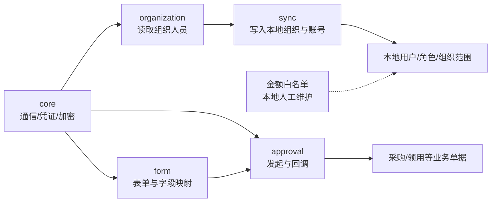

- `xinfutong-oa.config.ts`：读取 OA 地址、账套、账号、密钥和回调配置，供 OA 各子层统一使用。
- `xinfutong-oa.module.ts`：装配 OA 客户端、组织、表单、审批和同步服务，并把需要的能力暴露给采购、领用等业务模块。

### `integrations/xinfutong-oa/core`

`core` 是最底层 OA 通信能力，负责客户端、凭证、加密和基础类型，不理解采购申请或领用申请。

Client 使用 Credential 和 Crypto 完成请求，Types 约束协议，声明文件补齐第三方库类型，Spec 验证密码学实现。拆开后可以更换凭证缓存而不修改加密算法，也可以调整 HTTP 请求而不触碰业务映射；合并会让最底层通信代码知道上层表单和业务，破坏依赖方向。

- `client.ts`：发送 OA 基础 HTTP 请求，统一处理请求头、凭证和响应错误；上层 Organization、Form、Approval 服务通过它访问 OA。
- `credential.service.ts`：获取并缓存 OA 凭证，避免每次业务调用重复登录。
- `crypto.spec.ts`：测试 OA 加密、解密、签名和验签规则。
- `crypto.ts`：实现 OA 加密、解密和签名；被客户端和事件回调封装共同使用。
- `sm-crypto.d.ts`：补充国密加密库缺失的 TypeScript 类型，使加密实现可以被严格类型检查。
- `types.ts`：定义 OA 客户端请求、响应和凭证基础类型，供 Core 及上层服务共享。

### `integrations/xinfutong-oa/organization`

`organization` 只读取 OA 组织、部门、职位和员工，是同步服务的数据来源，不负责创建本地账号和角色。

Service 负责读取和整理，Types 固定数据结构，Spec 验证层级与字段。写入本地用户由 Sync 层完成，必须分开，因为“OA 返回了什么”与“本地授予什么角色和组织”是两套规则；若合并，读取接口变化可能意外改变本地权限。

- `organization.service.spec.ts`：测试 OA 组织、部门、职位和员工读取及数据整理。
- `organization.service.ts`：通过 Core Client 获取 OA 组织人员资料，返回给 Sync 层，不直接写本地用户角色。
- `organization.types.ts`：定义 OA 组织、部门、职位和员工原始及整理后类型。

### `integrations/xinfutong-oa/form`

`form` 负责 OA 表单结构和进销存字段映射。Constants 提供固定映射，Mapping Service 合并数据库配置，Form Service 调用 OA 表单接口，Types 固定数据形状。

Form Service 只解决 OA 表单通信，Mapping Service 只解决字段转换，Constants 保存稳定基准，数据库保存可变配置，Types 连接各文件，Spec 分别验证。不能把全部映射写死进 Form Service，因为不同账套、表单模板和字典会变化；分开后接口通信不需要因业务字段调整而重写。

- `form-mapping.constants.spec.ts`：测试固定业务表单与 OA 控件映射。
- `form-mapping.constants.ts`：定义稳定的业务表单代码及 OA 字段映射基准；可配置值仍应来自数据库字典或映射表。
- `form-mapping.service.ts`：合并固定基准和数据库配置，执行进销存字段与 OA 控件字段转换。
- `form.service.spec.ts`：测试 OA 表单定义读取和表单数据提交。
- `form.service.ts`：通过 Core Client 调用 OA 表单接口，供 Document Submission 等上层服务使用。
- `form.types.ts`：定义 OA 表单、控件和字段值类型。

### `integrations/xinfutong-oa/approval`

`approval` 负责业务单据发起审批和处理回调。Submission 管提交转换，Approval Service 管接口调用，Callback 管结果落地，Starter Context 管发起身份，Event Envelope 管外部事件解析和验签。

审批发起方向是业务模块 → Document Submission → Form Mapping/Starter Context → Approval Service；回调方向是外部事件 → Event Envelope 验签 → Approval Callback → 本地业务服务。发起和回调必须拆开，因为调用方向、鉴权和失败处理相反。若合成一个文件，外部未经验证的数据可能直接进入本地状态更新，也难以区分提交失败与回调失败。

- `approval-callback.service.ts`：根据已验签的 OA 审批结果定位本地单据，并调用相应业务服务更新状态。
- `approval.service.spec.ts`：测试 OA 审批请求、响应及异常处理。
- `approval.service.ts`：调用 OA 审批接口，管理审批实例标识和提交结果。
- `approval.types.ts`：定义 OA 审批提交、实例状态和回调数据类型。
- `document-submission.service.ts`：把采购、领用等本地单据转换成 OA 表单并发起审批，连接业务模块、Form Mapping 和 Approval Service。
- `event-envelope.spec.ts`：测试 OA 事件解析、时间戳和验签。
- `event-envelope.ts`：解析、校验并封装 OA 回调事件；通过后才交给 Callback Service，形成外部数据安全边界。
- `starter-context.service.ts`：根据本地申请人身份、固定组织和 OA 映射确定审批发起上下文。

### `integrations/xinfutong-oa/sync`

`sync` 把 OA 组织人员转成本地组织、员工、用户、角色和数据范围。Sync Service 管主流程，Org Sync Job 管任务执行，测试分别验证登录用户生成、任务流程和数据排序。

Job Service 决定何时执行并记录结果，Sync Service 决定如何比对和写入，排序规则保证父级先落库，各 Spec 针对不同风险验证。它们不能并入 Organization Service：Organization 只忠实读取 OA，Sync 才执行本地账号、自动角色和组织授权策略；金额白名单仍由本地人工维护，不进入这条自动同步链。

- `org-sync-job.service.spec.ts`：测试组织同步任务的执行、状态和异常记录。
- `org-sync-job.service.ts`：作为定时任务或人工同步入口调用 Organization Service 和 Sync Service，并记录一次任务结果。
- `sync-login-user.spec.ts`：测试 OA 有效员工被转换为可登录用户、固定组织和默认角色。
- `sync.service.spec.ts`：测试组织、部门、职位、员工、账号和角色同步主流程。
- `sync.service.ts`：OA 主数据落入本地的核心编排服务；调用 Organization Service 读取数据，再通过 Prisma 更新本地资料、登录账号、自动角色和组织范围，但不自动授予金额白名单。
- `to-sort.spec.ts`：测试同步数据按父子关系和顺序字段排序，防止子组织早于父组织写入。

---

# 4. `packages` 共享代码逐级说明

`packages` 与 `apps` 同级。`apps` 中的项目可以独立运行，`packages` 中的内容不能独立启动，只能被多个应用引用。把共享类型放在这里，是为了避免前端和后端各自定义一份同名接口后逐渐不一致；这里不能放 Vue 页面、NestJS Controller 或数据库访问逻辑。

当前只有 `contracts` 一个子包，不代表可以直接把它放回 Web 或 API：它的所有权属于双方。未来若增加独立 UI 包或公共规则包，应继续作为同级 Package，而不是让一个应用反向依赖另一个应用的源码。

## 4.1 `packages/contracts`

`contracts` 是前后端共享契约包。它只表达双方都需要理解的数据形状和公共约定，不决定页面如何显示，也不执行后端业务。它与 `apps/web/src/views/business/business-document-config.ts` 的区别是：后者是前端展示配置，前者是跨应用的数据契约。

根级 Package、TypeScript 配置和 `src` 源码拆开，是构建系统的标准边界：Package 文件声明如何被引用，Tsconfig 声明如何编译，Src 才保存契约内容。三者可以挤进根目录，但包入口、编译产物和源文件会混杂，工作区无法稳定引用。

- `package.json`：声明共享契约包的名称、入口和构建依赖；`apps/web` 与 `apps/api` 通过工作区依赖引用它。
- `tsconfig.json`：共享契约包的 TypeScript 编译规则，继承根级配置并限定本包源码范围。

### 4.1.1 `packages/contracts/src`

`src` 是契约包的源码叶子目录。当前契约集中导出，后续只有当类型数量明显增长时才应按业务域继续拆分。

- `index.ts`：导出前后端共同使用的分页、API 返回、用户身份、权限或业务数据类型；修改公开字段会同时影响前端调用方和后端返回方，因此需要两端一起进行类型检查。

---

# 5. `database` 数据库结构逐级说明

`database` 与 `apps/api/prisma` 分工明确：Prisma Schema 描述“当前数据库最终应该长什么样”，这里的 Migration 描述“已有数据库按什么顺序变成该结构”。业务代码不能在运行时读取这些 SQL；部署人员按日期和环境执行它们。迁移文件一旦在共享环境执行，原则上不回头改原文件，而是新增后续修正脚本。

Database 当前只有 Migrations 子目录，是为了把升级脚本与未来可能出现的备份说明、审计脚本明确区分。不能把 SQL 散放在 API 源码旁，因为 TypeScript 构建不会执行它们，开发人员也难以判断其部署顺序。

## 5.1 `database/migrations`

`migrations` 是数据库变更历史叶子目录。文件名前缀是日期，后半段说明变更主题；同一天多个文件需要结合依赖关系确认执行顺序。它与数据字典的关系是：字典项如果属于可配置业务枚举，应通过迁移写入字典表，不应写死在业务代码里。

每项结构变更独立成 SQL 文件，不是因为数据库不能一次执行大脚本，而是为了让上线范围、回滚判断和环境补丁可追溯。多个 Migration 按时间顺序累积，后一个可以依赖前一个已经创建的表或字段，但不能静默修改已执行文件。若所有历史合成一个 SQL，新环境可以初始化，已有环境却无法判断哪些变更尚未执行。

- `20260804_business_number_constraints.sql`：建立业务单号生成和唯一性约束，为后端 `business-number` 模块提供数据库保障。
- `20260804_inventory_general_orders.sql`：增加通用入库、通用出库相关表和字段，对应库存通用出入库页面与服务。
- `20260807_aftersales_and_bom_returns.sql`：补充售后记录和 BOM 退料结构，对应销售售后与生产退料业务。
- `20260807_business_document_attachments.sql`：建立业务单据附件关系，对应后端 `attachments` 和前端附件组件。
- `20260807_goods_master_defaults.sql`：补齐商品主数据默认值，保证旧商品能满足新字段约束。
- `20260807_inventory_business_extensions.sql`：扩展盘点、调整、报损、盘盈和调拨等库存业务结构。
- `20260807_requisition_return_location.sql`：补充领用退回去向或库位相关字段。
- `20260809_complete_column_comments.sql`：完善数据库字段注释，提升数据字典和运维可读性，不改变业务流程。
- `20260809_purchase_business_number_format.sql`：调整采购业务单号格式，与统一编号服务保持一致。
- `20260809_sales_order_no_approval.sql`：调整销售订单无需本系统审核的状态或字典规则。
- `20260810_huasu_home_order_source_mapping.sql`：增加华溯之家订单来源映射，支持外部订单幂等同步。
- `20260810_oa_approval_tables.sql`：建立 OA 审批提交、映射、回调或记录所需结构。
- `20260813_customer_identity_levels.sql`：增加客户身份等级结构，供外部用户和销售数据映射。
- `20260813_purchase_order_application_detail_source.sql`：在采购订单明细保存采购申请明细来源，支撑拆单生成和防重复生成。
- `20260814_scheduled_task.sql`：建立定时任务配置结构。
- `20260814_scheduled_task_run.sql`：建立定时任务运行记录结构，与任务配置表分开保存执行历史。
- `20260815_user_amount_access.sql`：建立用户金额查看、编辑白名单，与普通角色权限独立叠加。
- `20260817_account_set_event_public_key.sql`：增加 OA 账套事件验签公钥配置。
- `20260817_default_oa_staff_applicant_role.sql`：建立 OA 员工同步后的默认申请人角色规则。
- `20260817_historical_unit_and_org_warehouse_cleanup.sql`：清理历史单位及组织—仓库异常测试数据。
- `20260817_user_authorized_org_and_oa_permission_dictionary.sql`：增加用户额外组织授权，并以字典保存 OA 权限相关可配置值。
- `20260817_user_identity_and_org_scope.sql`：建立登录用户、员工身份、固定组织和组织范围关系。
- `20260818_per_menu_actions_and_manual_org_scope.sql`：增加菜单级查看、新增、编辑、删除等操作权限及人工组织授权。
- `20260818_purchase_manager_role.sql`：初始化采购经理角色及对应权限。
- `20260818_sales_order_type_no_output.sql`：增加无需出库的销售订单类型规则。
- `20260818_shifang_qingyuan_scheduled_tasks.sql`：初始化十方清源同步任务配置。
- `20260818_standard_business_roles.sql`：初始化财务、仓管、生产、普通员工等标准业务角色。
- `20260818_user_role_manual_override.sql`：支持本地人工调整用户角色，同时保留 OA 身份来源边界。
- `20260819_flatten_menu_hierarchy.sql`：调整菜单层级结构，配合新的菜单权限展示。
- `20260824_dashboard_role_widgets.sql`：增加角色可见工作台组件配置，使工作台模块权限纳入角色管理。
- `20260824_goods_info_sku_good_id_index.sql`：为商品 SKU 外键或查询字段增加索引，提升商品明细查询稳定性。
- `20260824_move_technology_department_to_huashu_biotech.sql`：修正技术部门所属组织的历史主数据。
- `20260824_purchase_order_receiver_todo.sql`：补充采购订单收货人待办所需字段、字典或任务数据。
- `20260824_shifang_qingyuan_agent_order_scheduled_task.sql`：增加十方清源代理订单同步任务。
- `README.md`：说明迁移脚本的执行原则、数据库环境和注意事项；部署前应先阅读它，而不是直接批量执行 SQL。

---

# 6. `deploy` 部署文件逐级说明

`deploy` 保存“项目如何进入服务器环境”的配置，与根级 `compose.yaml` 的本地或整体编排互补。它不包含采购、库存等业务规则。部署文件与应用源码分开，是为了让域名、反向代理、初始化挂载等环境问题不污染代码。

当前只有 Docker 子目录，因为现阶段只维护这一种部署方式。未来若增加 Kubernetes 或其他部署方案，应作为同级目录；不同部署方案可以引用同一应用镜像，但不能互相覆盖私有配置。

## 6.1 `deploy/docker`

`docker` 存 Docker 部署说明和外围服务配置。它与 `apps/web/Dockerfile`、`apps/api/Dockerfile` 的关系是：应用目录中的 Dockerfile 负责构建单个镜像，这里负责镜像如何被网关和数据库初始化环境使用。

README、Nginx 和 Initdb 拆开，是因为它们分别面向部署人员、反向代理进程和数据库容器；三者没有运行时互相调用关系。把 Nginx 配置写进说明文档或把初始化 SQL写进 Nginx 目录都可能被人阅读，却不会被正确的程序加载。

- `README.md`：说明 Docker 环境的准备、启动、升级和排障方法。
- `nginx.conf`：配置前端静态资源、API 反向代理和浏览器路由回退。

### 6.1.1 `deploy/docker/initdb`

`initdb` 预留数据库容器首次启动时自动执行的初始化脚本。当前不保存正式 SQL，避免把有顺序要求的 Migration 误当作每次初始化文件。

- `.gitignore`：保留空目录同时忽略本地临时初始化文件，防止数据库导出或敏感数据误提交。

---

# 7. `docs` 文档目录逐级说明

`docs` 保存不参与程序运行、但决定“为什么这样设计、如何验收、如何使用”的资料。它与代码目录的关系是证据与实现：需求和规范约束代码，实施记录证明某次改动做过什么，用户指引面向最终操作者。文档不能替代自动化测试，代码也不能脱离已确认文档擅自改变业务口径。

Docs 的三个主要方向是长期基准、每日证据和用户手册：`global` 按主题维护当前有效规则，`daily` 按日期保存当时交付事实，`用户操作指引` 按业务任务服务最终用户。三者不能合并成一套时间顺序文档，否则用户手册会夹杂技术流水，长期规则也会被埋在某一天的记录里。

- `README.md`：整个文档区的导航和归档规则。

## 7.1 `docs/global`

`global` 存跨日期长期有效的资料。它按用途拆为架构、设计、集成、计划、需求、规则和界面标准；与 `daily` 的区别是这里保存当前长期基准，`daily` 保存某一天的实施证据。

这些子目录不是按开发人员或业务模块随意划分，而是按文档用途划分：Requirement 定义目标，Plan 定义步骤，Design 定义方案，Standard/Rule 定义长期约束，Integration 保存外部协议，Architecture 解释代码结构。一次需求可能引用多个目录中的文件，但每份文件只能有一个主要职责；若全部平铺，无法判断哪份是当前规则、哪份只是历史计划。

- `README.md`：长期文档分类和阅读入口。

### 7.1.1 `docs/global/architecture`

`architecture` 解释系统代码和技术结构，回答“系统由哪些部分组成、为什么这样拆”。它不记录单日开发流水。

- `HSPSI代码目录逐文件说明-20260827.md`：当前这份目录导航；按真实目录解释每层职责和每个受版本控制文件的作用。

### 7.1.2 `docs/global/design`

`design` 保存已经形成的产品或技术设计说明。它与 `requirements` 的区别是：需求说明要解决什么，设计说明准备怎样组织界面、权限和系统能力。

- `华溯之家与HSPSI权限机制对比及RBAC复用设计-20260818.md`：比较外部系统与本系统权限机制，并说明 RBAC 复用边界。
- `大型企业级进销存敏感字段权限设计说明.md`：说明金额等敏感字段采用独立白名单并与角色、组织权限叠加的行业化设计。
- `当前需求前端界面设计方案-20260809.md`：记录当期前端字段、弹框和交互设计基准。

### 7.1.3 `docs/global/integrations`

`integrations` 保存外部接口的业务约定和实施边界。它与后端 `src/integrations` 对应：这里是人可阅读的协议和方案，后者是实际适配代码。

- `OA审批对接专项计划（暂缓）.md`：记录暂缓的 OA 审批专项范围和恢复条件。
- `OA审批流程清单与接口字段说明-20260809.md`：列出 OA 审批表单、流程和接口字段。
- `OA审批流程结束事件.md`：说明 OA 审批完成事件的数据结构和处理要求。
- `OA审批表单字段设计-20260811.md`：定义各业务表单推送 OA 时的字段设计。
- `OA审批表单实际字段映射-20260812.md`：记录本地字段与 OA 实际控件的对应关系。
- `OA审批附件上传实施方案-20260811.md`：说明业务附件向 OA 提交的方案。
- `统一审批与OA双模式改造计划.md`：说明本地审批与 OA 审批双模式的统一边界。
- `薪福通OA审批对接说明.md`：薪福通 OA 接口总说明。

#### 7.1.3.1 `docs/global/integrations/huasu-home`

该目录保存华溯之家原始接口说明和同步口径，供 `apps/api/src/integrations/huasu-home` 实现与核验。列表文档描述读取接口，同步文档描述落入本系统后的规则，请求规则描述所有接口共用的认证和格式。

- `会议门票订单列表.md`：会议门票订单列表接口字段与示例。
- `分期订单列表.md`：分期订单列表接口字段与示例。
- `商品列表.md`：商品列表接口字段与示例。
- `商品同步.md`：商品和 SKU 同步到本系统的业务规则。
- `用户列表.md`：用户列表接口字段与示例。
- `用户同步.md`：外部用户同步为本地客户或账号的规则。
- `订单列表.md`：普通订单列表接口字段与示例。
- `订单同步.md`：订单、收款、出库和售后同步规则。
- `订单详情.md`：单笔订单及明细接口字段。
- `请求规则.md`：华溯之家接口认证、签名、分页和错误处理规则。

#### 7.1.3.2 `docs/global/integrations/shifang-qingyuan`

该目录保存十方清源接口原文和本地同步口径，与同级华溯之家完全隔离，防止两个系统相似字段被错误复用。

- `cloud-stock-agent-order-api.md`：代理订单或云库存订单接口说明。
- `goods-api.md`：商品接口说明。
- `order-api.md`：订单接口说明。
- `user-api.md`：用户接口说明。
- `商品同步.md`：十方清源商品同步规则。
- `用户同步.md`：十方清源用户同步规则。
- `自提订单同步.md`：自提或代理订单进入本系统的规则。
- `订单同步.md`：普通订单、付款、出库和售后同步规则。

#### 7.1.3.3 `docs/global/integrations/xft-oa`

该目录保存薪福通 OA 专属接口资料。目前只有事件订阅说明；其实现对应后端 `xinfutong-oa/approval/event-envelope.ts` 和回调服务。

- `事件订阅概述.md`：OA 事件订阅、回调、验签和重试概述。

### 7.1.4 `docs/global/plans`

`plans` 保存尚待实施、分阶段实施或需要长期维护的改造方案。它与 `daily` 实施记录的关系是“计划与结果”：计划说明准备做什么及审核点，完成后必须在 Daily 留下实际结果，不能用计划文件冒充完成证明。

- `OA审批对接数据库表设计.md`：OA 审批相关数据库结构方案。
- `OA账套维度表单映射改造计划-20260819.md`：按 OA 账套隔离表单映射的改造计划。
- `借用调拨专项计划（暂缓）.md`：暂缓的借用、归还和调拨专项边界。
- `停业组织业务隔离实施方案.md`：停业组织不可继续产生业务的隔离方案。
- `全局业务单号与采购主键改造计划.md`：统一单号及采购主键约束计划。
- `全局金额白名单实施方案.md`：金额查看、编辑白名单的全局实施方案。
- `全系统组织仓库商品联动约束改造Handoff-20260812.md`：组织—仓库—仓库类型—商品联动的交接文档。
- `单据附件专项计划（暂缓）.md`：暂缓或分阶段完成的单据附件计划。
- `商品分类树形展示改造计划.md`：商品分类树形展示和选择计划。
- `多分支整合计划-20260810.md`：多个功能分支合并与验收计划。
- `定时任务管理实施方案.md`：定时任务配置、执行和记录设计。
- `幂等键去数据库化改造计划（暂缓）.md`：暂缓的外部同步幂等键存储方式调整。
- `库存及业务规则改造计划.md`：库存数量、批次、过账及关联业务规则计划。
- `权限与前端共享页面整改计划-20260819.md`：权限执行与共享页面拆分整改计划。
- `权限模型一步到位设计-20260819.md`：角色、菜单动作、固定组织和额外组织的权限模型设计。
- `组织部门岗位人员权限链实施方案.md`：OA 组织、部门、岗位、人员与本地权限链方案。
- `采购申请拆单生成采购订单界面与字段映射.md`：采购申请整单、选品拆单生成订单的界面和字段映射。
- `阶段4冒烟验证记录-20260819.md`：权限改造阶段四的冒烟验证基准。

#### 7.1.4.1 `docs/global/plans/前端重构丢失界面交互恢复`

该目录是前端重构后功能等价性恢复的总计划叶子目录。它把跨采购、库存、领用、生产、销售的恢复事项放在同一个总账中，避免每个页面孤立修补。

- `实施构想与改造总账.md`：记录丢失功能、P0/P1/P2 优先级、实施顺序、验收点和完成状态。

#### 7.1.4.2 `docs/global/plans/库存预警筛选与查看交互修复`

该目录只管理库存预警筛选及查看交互这一项原始需求，避免实施记录拆散后无法追溯需求来源。

- `实施构想.md`：库存预警筛选字段、查看弹框和验收标准。

#### 7.1.4.3 `docs/global/plans/销售订单操作列交互优化`

该目录只管理销售订单操作列的产品和交互优化。

- `实施构想.md`：销售订单主操作、“更多”操作及状态显示规则。

### 7.1.5 `docs/global/requirements`

`requirements` 保存经确认的业务需求基线，优先回答“用户必须完成什么业务”，不包含逐次代码改动流水。

- `当前需求最终实施计划-20260807.md`：当期需求最终边界、顺序和验收计划。
- `当前需求汇总与实施构想-20260807.md`：当期需求来源、总体构想和模块范围。
- `采购订单明细计价规则.md`：采购总金额反算单价等订单明细计价口径。

### 7.1.6 `docs/global/rules`

`rules` 保存所有后续开发必须遵守的过程规则。它高于某一天的实施记录；若规则与临时做法冲突，应先确认是否修改规则，而不是静默绕过。

- `AI功能开发与交付规则.md`：规定需求确认、数据库核对、界面设计、字段映射、实现、测试和文档归档顺序。

### 7.1.7 `docs/global/standards`

`standards` 保存可重复使用的 UI 或技术标准。它与 `design` 的区别是：Design 面向某个方案，Standard 面向所有后续相似页面。

- `Element Plus Table表格样式归档.md`：列表、弹框、表格间距、操作列和状态展示的统一 UI 依据。

## 7.2 `docs/daily`

`daily` 按日期保存实际交付证据。每个日期目录回答“当天做了什么、如何测试、还剩什么”，不作为长期需求的唯一来源。下面逐日期说明文件职责；文件名本身保持原始需求颗粒度。

日期子目录按时间并列，不互相覆盖；同一天的多个文件按原始一级需求拆分，综合日报只汇总，不取代专项实施记录。可以把一天所有内容写进一个巨大日报，但后续无法单独查找某项缺陷的代码、测试和遗留问题，也无法在需求继续迭代时保持连续记录。

- `README.md`：Daily 目录命名、归档和查阅规则。

### 7.2.1 `docs/daily/2026-08-09`

该目录保存 8 月 9 日的需求、测试和工作记录，三份文件分别承担日报、测试清单和需求实施状态，避免互相替代。

- `2026-08-09工作记录.md`：当天完成事项和遗留问题。
- `当前版本测试用例清单-20260809.md`：当时版本的功能测试用例。
- `当前需求实施记录表-20260809.md`：逐项记录需求实施和验收状态。

### 7.2.2 `docs/daily/2026-08-10`

该目录保存分支整合和当日开发交付证据。

- `2026-08-10工作记录.md`：当天工作流水和结果。
- `AI全栈开发工程师工作日报-20260810.md`：以开发视角整理的日报。
- `分支整合实施记录-20260810.md`：本地及远端分支整合内容。
- `分支整合测试验收清单-20260810.md`：整合后用于防止功能丢失的验收项。

### 7.2.3 `docs/daily/2026-08-11`

该目录保存采购计价和领用 OA 两项独立需求的实施结果。

- `采购订单计价规则实施记录-20260811.md`：总金额反算单价等采购计价实现与测试。
- `领用申请OA审批实施记录-20260811.md`：领用申请推送 OA、回调和状态处理记录。

### 7.2.4 `docs/daily/2026-08-12`

该目录集中记录 OA 字段映射、停业组织隔离以及组织—仓库—商品约束的审计与改造。

- `OA审批表单字段映射实施记录-20260812.md`：OA 字段映射落地结果。
- `停业组织业务隔离实施记录.md`：停业组织隔离实现和验证。
- `全系统组织仓库商品联动历史数据审计.md`：历史数据违反组织仓库商品约束的清单和处理结论。
- `全系统组织仓库商品联动约束改造实施记录.md`：全局联动约束实现和测试结果。

### 7.2.5 `docs/daily/2026-08-13`

该日期只记录采购申请拆单生成订单这一条完整需求。

- `采购申请拆单生成采购订单实施记录.md`：数据库来源字段、整单/选品生成、金额规则和防重复生成结果。

### 7.2.6 `docs/daily/2026-08-14`

该目录记录远程下拉、定时任务、组织仓库商品约束补齐及日报。

- `下拉选项远程搜索修复实施记录.md`：将大数据选项改为远程搜索或按需加载的结果。
- `定时任务管理实施记录.md`：任务配置、调度、执行记录实现结果。
- `工作日志-20260814.md`：当天综合工作记录。
- `组织仓库商品联动约束补齐实施记录.md`：对遗漏页面补齐组织—仓库—商品限制。

### 7.2.7 `docs/daily/2026-08-15`

该日期只记录金额白名单全局实施。

- `全局金额白名单实施记录.md`：金额查看与编辑白名单、前后端脱敏和测试结果。

### 7.2.8 `docs/daily/2026-08-17`

该目录记录 OA 回调、OA 人员账号、组织权限、历史数据和售后 UI 等多项交付，每份文件保持独立验收边界。

- `OA事件订阅回调实施记录.md`：OA 事件验签、解析和回调处理。
- `OA人员同步写入登录账号实施记录.md`：OA 员工同步生成本地登录账号。
- `OA全员基础账号与多账套身份实施记录.md`：全员账号与多账套身份映射。
- `全系统非权限业务链路自动化测试报告.md`：排除权限后的主业务链路测试结果。
- `历史数据及组织人员权限链修复记录.md`：历史组织人员数据和权限链异常修复。
- `售后记录界面修复记录.md`：售后查看、编辑和处理进展 UI 修复。
- `授权组织与OA自动授权实施记录.md`：OA 同步角色、组织与本地额外组织授权实现。

### 7.2.9 `docs/daily/2026-08-19`

该目录记录登录、OA 回调、OA 人员、账套映射、十方任务、销售拦截及日报。

- `DEV登录400-JWT过大缺陷修复实施记录.md`：登录令牌过大导致 400 的定位和修复。
- `OA事件回调按表单模板过滤实施记录.md`：按表单模板过滤 OA 事件，防止错误业务处理。
- `OA人员同步out_staff_id为空缺陷修复实施记录.md`：外部员工标识为空的同步修复。
- `OA账套维度表单映射实施记录.md`：多账套 OA 表单映射实现。
- `十方清源后台任务管理实施记录.md`：十方清源定时任务接入结果。
- `工作日志-20260819.md`：当天综合工作记录。
- `无需出库销售订单拦截出库实施记录.md`：无需出库订单的后端操作拦截。

### 7.2.10 `docs/daily/2026-08-20`

该目录是前端重构后的分阶段审核证据，按审计、共享引擎、采购恢复三个审核点保存。

- `共享引擎扩展与组件边界设计-审核点二.md`：通用业务引擎扩展方式与组件边界确认。
- `采购前端恢复实施结果-审核点三.md`：采购页面和弹框功能恢复结果。
- `重构前后功能等价性审计-审核点一.md`：旧分支与重构分支的字段、组件和操作差异审计。

### 7.2.11 `docs/daily/2026-08-21`

该目录记录 OA 测试、华溯之家用户来源修复、外部订单库存过账和日报。

- `OA表单功能测试用例-20260821.md`：OA 表单提交、回调和异常场景用例。
- `华溯之家用户同步来源ID判断调整实施记录.md`：外部用户来源标识判断修复。
- `外部订单出库过账键改用出库单ID实施记录.md`：外部订单库存幂等键调整结果。
- `工作日志-20260821.md`：当天综合工作记录。

### 7.2.12 `docs/daily/2026-08-24`

该目录记录业务弹框明细恢复、十方自提订单和工作台角色组件改造。

- `业务单据表单弹窗明细丢失系统性修复实施记录.md`：重构后弹框明细缺失的系统性修复。
- `十方清源自提订单同步实施记录.md`：自提或代理订单同步落地结果。
- `工作台角色模块与组织数据范围改造实施记录.md`：工作台按角色显示组件、按组织范围统计数据的实现记录。

### 7.2.13 `docs/daily/2026-08-25`

该目录记录连续缺陷修复、仓库商品联动、消息、日志和领用批次预检，每个文件对应一条可独立验收的工作。

- `BUG-NEW-01至03修复实施记录.md`：三个新发现缺陷的定位、修复和验证。
- `PM-15确认入库403组织归属修复实施记录.md`：确认入库时组织权限误判的修复。
- `PM-19操作记录补全实施记录.md`：业务操作历史记录补齐。
- `仓库商品双向联动改进实施记录.md`：仓库限制商品、商品反向限制仓库的交互改进。
- `消息中心与审批入库消息实施记录.md`：消息中心及审批后入库消息实现。
- `系统错误日志Winston实施记录.md`：后端结构化运行和错误日志接入。
- `领用出库确认批次预检改进实施记录.md`：领用出库前批次库存校验改进。

### 7.2.14 `docs/daily/2026-08-26`

该目录保存库存预警、调拨和销售操作列三项独立修复；大型“前端重构丢失界面交互恢复”继续放在其子目录，保持原始一级需求不被拆散。

- `调拨单发出接收人校验修复实施记录.md`：调拨发出、接收人员及组织校验修复。

#### 7.2.14.1 `docs/daily/2026-08-26/前端重构丢失界面交互恢复`

该目录按优先级和复盘编号保存重构功能恢复的实施证据，与 Global 中的总账一一对应。

- `00-改造计划建立记录.md`：恢复任务、优先级和实施顺序的起点。
- `P0-01-采购订单生成入库与分批入库实施记录.md`：采购订单生成入库和分批收货恢复。
- `P0-02-采购订单退回未到货弹框实施记录.md`：未到货商品退回弹框恢复。
- `P0-03至P0-06-剩余P0批量改造总实施记录.md`：其余最高优先级业务闭环恢复。
- `P0-R01-采购订单全量退回未到货业务闭环问题复盘记录.md`：全量退回逻辑缺陷复盘和修正依据。
- `P0-R01及P2-01至P2-03-剩余改造总实施记录.md`：复盘项与剩余 P2 交互恢复结果。
- `P1-01至P1-11-P1批量改造总实施记录.md`：追溯、操作记录、附件等 P1 项目恢复结果。

#### 7.2.14.2 `docs/daily/2026-08-26/库存预警筛选与查看交互修复`

- `实施记录.md`：库存预警筛选与查看交互的实际代码、测试和验收结果。

#### 7.2.14.3 `docs/daily/2026-08-26/销售订单操作列交互优化`

- `实施记录.md`：销售订单操作列优化的实际结果和验证。

## 7.3 `docs/用户操作指引`

`用户操作指引` 面向最终操作者，按业务模块而不是代码目录组织。它与 Global 设计文档的区别是：这里只讲用户怎样完成任务，不解释数据库、组件或后端服务。

各章节按用户实际菜单和业务链路并列，README 负责串联阅读顺序。拆成多文件后可以单独交付采购、库存或生产培训；合成一本超长文件也能阅读，但每次单模块更新都要重发整本手册，角色用户也难以快速找到自己的操作范围。

- `README.md`：用户手册总目录和阅读顺序。
- `01-快速入门.md`：登录、布局、菜单和基础操作。
- `02-基础资料与商品管理.md`：组织、仓库、供应商、商品、分类和 SKU 操作。
- `03-采购管理.md`：采购申请、订单、入库、退货、付款和退款操作。
- `04-库存管理.md`：库存查询、盘点、调整、调拨、报损和盘盈操作。
- `05-生产管理.md`：BOM、生产计划、缺料、领料和成品入库操作。
- `06-销售管理.md`：销售订单、出库、退货、收退款、折价和售后操作。
- `07-领用管理.md`：领用申请、出库、签收和退回操作。
- `08-报表与系统管理.md`：报表、用户、角色、字典和任务管理操作。
- `09-单据状态与常见问题.md`：状态含义、异常提示和常见问题处理。

---

# 8. 项目根级文件逐文件说明

根级文件只管理整个工作区，不承载具体业务页面。它们分别控制协作约束、依赖锁定、应用编排、代码检查和跨应用编译；之所以放在根目录，是因为前端、后端和共享包都需要遵守。

- `AGENTS.md`：当前仓库的强制协作约束，包括本地数据库只能使用 `127.0.0.1:3306/hspsi-dev` 和功能交付顺序；所有自动化开发代理进入仓库后都应先遵守它。
- `compose.yaml`：组合前端、后端、数据库或其他依赖服务的容器运行关系。
- `eslint.config.mjs`：全工作区静态代码检查规则，约束潜在错误和代码质量。
- `handoff1.md`：阶段性交接说明，保存上一阶段上下文；它不是长期架构基准，内容需要结合当前代码核验。
- `handoff2.md`：后续阶段交接说明，与 `handoff1.md` 按形成时间共同提供接手背景。
- `package.json`：工作区统一命令、包管理器版本及公共开发依赖入口。
- `pnpm-lock.yaml`：锁定所有直接和间接依赖的精确版本，由 pnpm 维护，禁止人工编辑业务内容。
- `pnpm-workspace.yaml`：声明 `apps/*` 和 `packages/*` 属于同一工作区，使本地共享包能被应用引用。
- `prettier.config.mjs`：全工作区格式化规则，只影响代码排版，不改变业务逻辑。
- `tsconfig.base.json`：前端、后端、共享包共同继承的 TypeScript 基础规则。

---

# 9. 当前重要说明

1. 本文覆盖当前分支受版本控制的前端、后端、共享包、数据库、部署和文档文件；`node_modules`、构建产物、日志、本地环境变量和 Git 内部文件属于生成物或本机状态，不逐文件解释，也禁止把它们当业务源码修改。
2. 前端主业务按“路由页面 → 页面配置 → 业务表单 → 领域组件 → 公共工具”分层；一个功能应沿这条链定位，不能把所有逻辑重新塞回 Page。
3. 后端按“Module 装配 → Controller 接口 → Service 业务 → Database/Posting 基础能力 → Integration 外部适配”分层；Controller 不应直接拼复杂 SQL，外部适配也不能绕过内部业务约束。
4. `apps/api/prisma/schema.prisma` 是当前结构，`database/migrations` 是升级过程，数据字典是可配置业务枚举；三者职责不同，不能互相替代。
5. `purchase.service.ts`、`inventory.service.ts`、`sales.service.ts`、`production.service.ts`、`requisition.service.ts` 仍然偏大；后续改动应继续向生命周期、过账、审批和查询子服务拆分，不能开倒车。
6. 后续逐文件提问时，以实际源码为最终依据；本文负责建立导航和关系，源码变化后必须同步更新本文。
