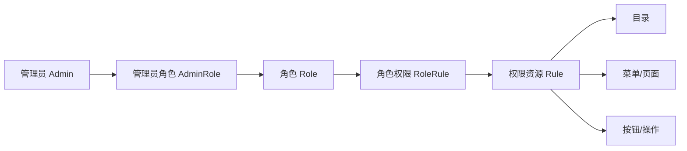
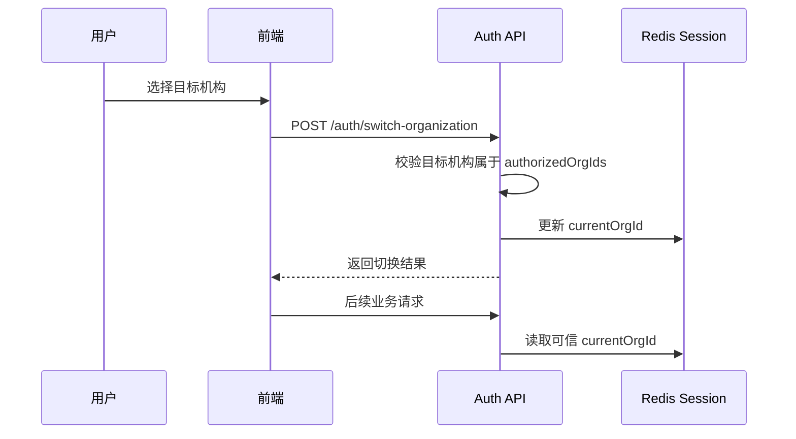
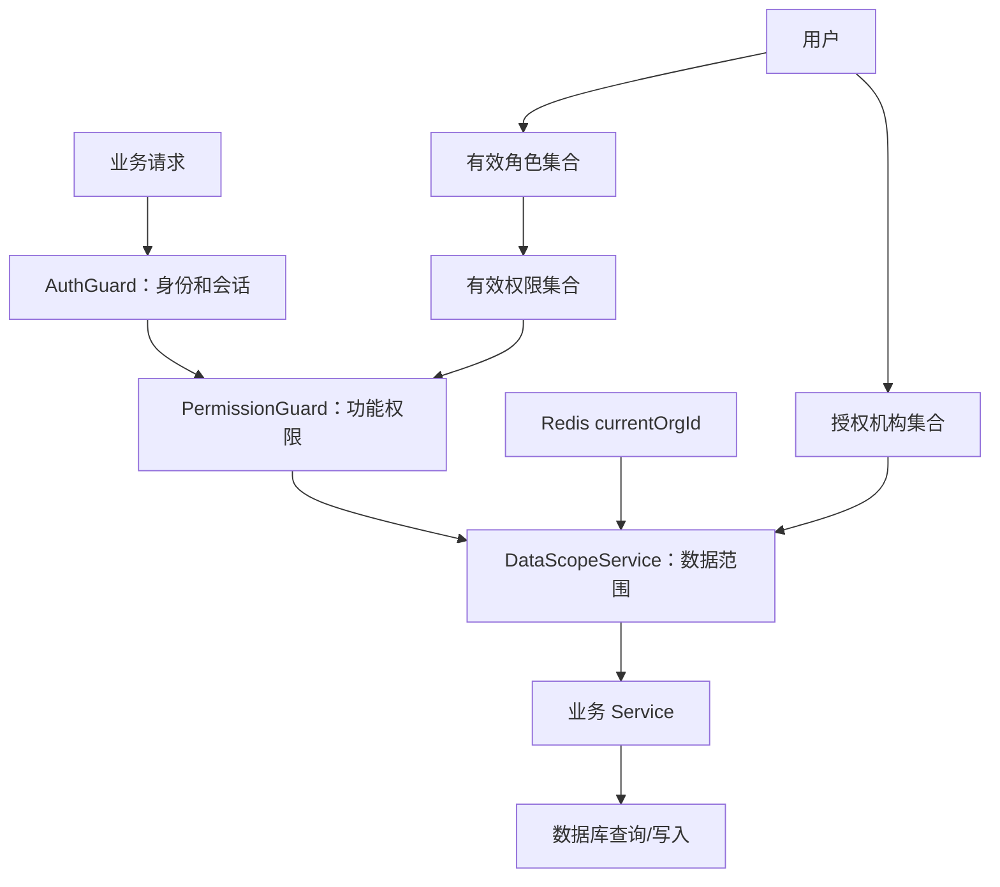

# 华溯之家与 HSPSI 权限机制对比及 RBAC 复用设计

> 文档状态：技术调研与复用建议（待业务确认）
> 调研日期：2026-08-18
> 调研对象：华溯之家管理后台、`hshome-api`、`hshome-backend`、HSPSI 现有前后端与本地数据库
> 目标：说明两个系统的权限机制、现存边界与风险，并形成可供 HSPSI 后续权限改造复用的模型思路
> 说明：本文不是实施批准文件；涉及新表、字段、数据字典和角色规则的内容，仍须按项目规则完成业务确认后方可实施。

---

## 1. 调研结论

华溯之家的权限设计可以概括为：

```text
功能权限：管理员 → 角色 → 权限资源（目录 / 菜单 / 按钮）
数据权限：管理员 → 全部数据 / 指定区域 / 指定机构
运行上下文：管理员在前端选择当前机构 → 请求携带 OrganizationId
```

HSPSI 当前权限设计可以概括为：

```text
功能权限：用户 → 角色 → 菜单/权限 code → @RequirePermissions → PermissionGuard
数据权限：角色 data_scope_type 只完成配置展示，业务查询尚未统一执行
运行上下文：部分模块使用用户主组织，部分模块信任前端 orgId，部分模块没有组织过滤
```

综合判断：

1. 华溯之家的“用户—角色—权限资源”RBAC 骨架可以复用。
2. 华溯之家的“功能权限与数据权限分离”思路可以复用。
3. 一个用户绑定多个角色、最终权限取并集的机制建议保留。
4. 目录、菜单、按钮统一由一棵权限资源树管理的产品交互可以复用。
5. 华溯之家现有的后端权限执行方式不能复用：它主要控制前端展示，没有形成后端接口授权闭环。
6. 华溯之家通过客户端 Header 选择机构、各业务服务自行过滤数据的方式不能复用。
7. HSPSI 已有 `PermissionGuard`，基础比华溯之家更好，但仍需解决权限粒度、失效时效、角色状态、默认放行和统一数据范围等问题。
8. 最终目标不应只是“复制华溯之家的权限管理页面”，而应建设“后端功能授权 + 后端数据授权 + 前端体验控制”三层一致的权限体系。

---

## 2. 权限模型术语

本文将权限拆成三个互相独立的维度：

| 维度 | 回答的问题 | 示例 |
| --- | --- | --- |
| 功能权限 | 用户能执行什么操作 | 查看采购单、审批采购单、分配角色 |
| 数据权限 | 用户能操作哪些数据 | 全部机构、指定机构、本人创建的数据 |
| 字段权限 | 用户能看到或修改哪些字段 | 成本价不可见、财务字段只读 |

其中：

- RBAC 主要解决“用户通过角色取得功能权限”。
- 组织、区域、本人数据等范围，更接近数据授权或 ABAC 上下文，不宜全部塞进角色。
- 前端菜单和按钮隐藏只属于用户体验控制，不能替代后端授权。

---

## 3. 华溯之家权限机制

### 3.1 核心实体与关系

华溯之家主要使用以下数据表：

| 表 | 作用 |
| --- | --- |
| `hszj_sys_admin` | 管理员账号 |
| `hszj_sys_role` | 角色 |
| `hszj_sys_rule` | 权限资源树，包含目录、菜单和按钮 |
| `hszj_sys_admin_role` | 管理员与角色的多对多关系 |
| `hszj_sys_role_rule` | 角色与权限资源的多对多关系 |
| `hszj_sys_data_scope` | 管理员的数据范围 |

功能权限关系：



管理员与角色、角色与权限资源均为多对多关系。因此，一个管理员可以同时拥有多个角色，最终权限是所有角色权限的并集。

### 3.2 权限资源树

`hszj_sys_rule` 同时承载以下信息：

- 父子层级 `parent_id`
- 资源类型 `type`
- 菜单名称 `name`
- 页面路由 `path`
- 前端组件 `component`
- 权限标识 `permission`
- 图标 `icon`
- 排序 `sort`
- 启停状态 `status`

系统管理界面将资源分成三类：

1. 目录：只用于组织导航层级。
2. 菜单：对应可访问页面。
3. 按钮：代表页面内操作或接口能力。

这种设计的优点是：角色分配权限时可以直接展示一棵业务树，产品和运营人员容易理解。

### 3.3 登录与会话

华溯之家登录流程：

```text
用户名和密码
  → 查询管理员
  → 校验密码与账号状态
  → 根据数据范围选取默认机构
  → 生成不透明 Token
  → Redis 保存 Token 与管理员映射
  → 返回用户信息和默认机构
```

每次受保护请求都会：

1. 从 Authorization Header 读取 Token。
2. 在 Redis 中找到管理员 ID。
3. 重新查询管理员。
4. 检查管理员是否存在、是否启用。
5. 将管理员信息放入请求上下文。

这一机制有两个可取点：

- Redis 中只保留一个有效 Token，可实现单会话登录。
- 每次请求重新检查账号状态，禁用账号能够快速生效。

但其密码使用双重 MD5 派生方案，Token 也只是 MD5 拼接结果，均不应复用。HSPSI 应继续使用 bcrypt/Argon2 和安全随机会话标识。

### 3.4 功能权限计算

普通管理员的权限计算链路：

```text
当前管理员 ID
  → 查询管理员的角色 ID
  → 查询角色对应的 Rule ID
  → 查询目录和菜单
  → 查询按钮权限标识
  → 将目录和菜单构造成树
```

后端返回：

```json
{
  "menus_permission": [],
  "route_permission": []
}
```

超级管理员和系统管理员不经过角色关联，直接取得所有启用的目录、菜单和按钮权限。

### 3.5 前端权限消费

前端登录后取得 `menus_permission`，保存到 Pinia 和 `localStorage`，并用它渲染左侧导航栏。

但代码核对结果表明：

- Vue Router 中仍然静态注册了全部页面路由。
- 全局路由守卫只校验是否存在 Token。
- 没有根据菜单权限阻止直接地址访问。
- `route_permission` 没有被存储或用于统一按钮控制。
- 没有发现统一的按钮权限指令或 `hasPermission()` 机制。

因此，华溯之家当前的前端权限主要等同于“隐藏左侧菜单”，不能视为真正授权。

### 3.6 功能权限的后端执行现状

后端全局中间件只执行身份认证，没有将“当前接口”映射到权限标识并检查当前管理员权限。

当前链路是：

```text
登录有效 → 接口通常可以调用
```

而安全的链路应当是：

```text
登录有效
  → 接口声明所需权限
  → 取得当前用户有效角色和权限
  → 满足权限才放行
```

这意味着，普通管理员即使看不到系统管理菜单，只要知道接口路径，仍可能直接请求角色、菜单、管理员等管理接口。

### 3.7 空权限错误放大

按钮权限查询只有在 `ruleIds` 非空时才增加 `whereIn` 条件。

因此，普通管理员没有角色或没有权限时，可能出现：

```text
预期：返回空按钮权限
实际：因为未添加过滤条件，返回全部按钮权限
```

这属于典型的 fail-open（失败时放行）。权限系统必须采用 fail-closed：无法确认权限时，一律拒绝或返回空范围。

### 3.8 数据权限模型

数据权限直接绑定管理员，而不是绑定角色。

| 类型 | 含义 | 存储方式 |
| --- | --- | --- |
| 全部数据 | 可访问所有机构 | 保存一条 ALL 记录 |
| 指定区域 | 可访问区域内的机构 | 保存一个或多个区域 ID |
| 指定机构 | 只能访问所选机构 | 保存一个或多个机构 ID |

权限展示时：

- 全部数据展开为所有启用机构。
- 指定区域展开为区域下的机构。
- 指定机构直接返回所选机构。

这个模型体现了“角色控制动作、用户控制负责范围”的解耦思想，值得复用。

### 3.9 当前机构切换

前端取得管理员可选机构列表，并在顶部提供机构选择器。选择后：

1. 将 `organization_id` 写入浏览器 `localStorage`。
2. 请求时自动发送 `OrganizationId` Header。
3. 后端中间件检查机构是否存在、是否启用。

安全缺口是：后端机构中间件没有检查该机构是否属于当前管理员的数据授权范围。

因此客户端可以篡改 Header，尝试访问其他有效机构。部分业务服务会再次手工查询授权机构并过滤，但这种处理分散在各 Service，覆盖不完整、行为不一致。

### 3.10 华溯之家权限风险汇总

| 等级 | 问题 | 影响 |
| --- | --- | --- |
| P0 | 后端没有统一功能权限 Guard | 已登录用户可能越权调用隐藏接口 |
| P0 | 当前机构只检查存在和启用，不校验用户授权 | 可能跨机构读取或操作数据 |
| P0 | 无角色时按钮权限查询可能返回全部 | 空权限被错误放大 |
| P0 | 数据范围由业务 Service 分散实现 | 漏加过滤即可造成数据越权 |
| P1 | 禁用角色未统一参与权限计算 | 禁用角色可能继续授权 |
| P1 | 权限资源状态过滤不完整 | 停用按钮权限可能继续返回 |
| P1 | 权限标识格式重复、过粗或不一致 | 难以稳定映射接口和审计 |
| P1 | 关系表缺少必要外键和唯一约束 | 可能产生重复或孤立授权关系 |
| P1 | 密码采用 MD5 派生 | 不符合当前密码安全要求 |
| P2 | 默认机构选择依赖查询顺序 | 默认机构不具备明确业务语义 |

---

## 4. HSPSI 当前权限机制

### 4.1 核心实体与关系

HSPSI 当前 Prisma 模型已经具备 RBAC 基础表：

| 表 | 作用 |
| --- | --- |
| `hspsi_sys_user` | 系统用户 |
| `hspsi_sys_role` | 角色 |
| `hspsi_sys_menu` | 菜单与权限 code |
| `hspsi_sys_user_role` | 用户角色关系 |
| `hspsi_sys_role_menu` | 角色菜单/权限关系 |

当前也是：

```text
用户 N:N 角色
角色 N:N 菜单/权限资源
```

`hspsi_sys_role.code` 已有唯一约束，`hspsi_sys_role_menu` 也使用联合主键，这是比华溯之家关系表更稳健的部分。

### 4.2 登录与权限加载

HSPSI 登录流程：

```text
用户名和密码
  → 查询启用用户
  → bcrypt 校验密码
  → 查询用户全部角色关系
  → 查询角色菜单
  → 查询启用菜单
  → 生成权限 code 数组
  → JWT 写入用户、组织、权限和 sid
  → Redis 保存 session:sid
```

如果用户具有启用的 `admin` 角色，则权限为 `['*']`，否则权限为菜单记录中的 `code`。

### 4.3 后端功能权限执行

HSPSI 已经具备：

- `AuthGuard`：验证 JWT 和 Redis Session。
- `@RequirePermissions(...)`：接口声明所需权限。
- `PermissionGuard`：判断当前用户是否有权限。
- `*`：管理员绕过。

这意味着 HSPSI 已经把功能权限放到了后端执行，整体基础优于华溯之家。

当前 `PermissionGuard` 的语义为：

```text
接口未声明权限 → 放行
用户包含 * → 放行
用户满足 required 中任意一个权限 → 放行
否则 → 403
```

### 4.4 当前功能权限不足

#### 4.4.1 未声明权限时默认放行

当 Controller 漏写 `@RequirePermissions` 时，`PermissionGuard` 返回 `true`。这会把安全性依赖在开发人员是否记得加注解上。

建议后续采用以下之一：

1. 受保护业务 Controller 默认要求权限，显式标注公开接口。
2. 建立 Controller 权限注解自动扫描测试，发现遗漏即构建失败。
3. 建立路由—权限清单，纳入代码评审和自动化校验。

#### 4.4.2 权限粒度偏粗

当前大量权限 code 仍是：

```text
purchase
sales
inventory
production
```

这只能控制是否进入整个模块，难以区分查看、新增、修改、删除、审批、导出和过账等高风险动作。

#### 4.4.3 多权限参数采用 OR

当前使用 `required.some(...)`，所以：

```ts
@RequirePermissions('a', 'b')
```

表示有 `a` 或 `b` 任意一个即可。后续应明确支持：

- `ANY`：满足任意一个权限。
- `ALL`：必须满足全部权限。

避免不同开发人员对注解语义理解不一致。

#### 4.4.4 角色状态没有完整过滤

权限加载时先从 `hspsi_sys_user_role` 取得角色 ID，再直接查询角色菜单；只有判断 `admin` 角色时检查了角色状态。

因此，普通角色被禁用后，它关联的菜单权限仍可能继续生效。

#### 4.4.5 JWT 中的权限存在时效窗口

`AuthGuard` 验证 JWT 后，只检查 `session:{sid}` 是否存在，不会重新加载用户状态、角色和权限。

因此：

- 修改角色权限后，旧 JWT 在到期前仍使用旧权限。
- 移除用户角色后，旧 JWT 在到期前仍可能继续授权。
- 禁用用户后，旧 JWT 在到期前仍可能通过 AuthGuard。

前端重新调用 Session 接口虽然能取得新菜单，但不会自动替换旧 JWT 中供后端 Guard 使用的权限。

### 4.5 当前数据权限现状

HSPSI 的 `hspsi_sys_role` 仍有 `data_scope_type`，但目前它主要用于配置展示，业务查询没有统一按该字段过滤。

现有模块大致分为三类：

| 模式 | 示例 | 风险 |
| --- | --- | --- |
| 使用 `user.orgId` | goods、dashboard | 只能使用用户主组织，无法支持会话切换 |
| 使用前端 `query.orgId` | base-data、inventory | 信任前端入参，可能越权 |
| 没有统一组织过滤 | purchase、sales 等部分模块 | 可能跨组织查询 |

因此，HSPSI 当前同样没有形成统一数据授权闭环。

### 4.6 本地数据库与待实施文件状态

本次以 `apps/api/.env` 为准，确认本地数据库连接为：

```text
127.0.0.1:3306/hspsi-dev
```

2026-08-18 实际只读查询结果：

- 当前本地库已存在 `hspsi_sys_menu`、`hspsi_sys_role`、`hspsi_sys_role_menu`、`hspsi_sys_user_role`。
- 当前这些权限表没有可用于验证完整 RBAC 行为的实际角色和菜单数据。
- `hspsi_sys_role.data_scope_type` 仍存在。
- 用户授权组织等待实施迁移尚未体现在当前数据库中。

仓库中存在待实施或未跟踪的权限迁移、草案文件，其中有两种互相冲突的角色口径：

1. 基础角色与岗位角色叠加，即一个用户可以拥有多个角色。
2. 给用户角色关系增加 `user_id` 唯一约束，即一个用户只能拥有一个角色。

该问题必须在实施前由业务负责人确认。按照标准 RBAC、华溯之家现有机制和 HSPSI 当前表结构，技术上建议保留多角色关系。

---

## 5. 两个系统的机制对比

| 能力 | 华溯之家 | HSPSI | 判断 |
| --- | --- | --- | --- |
| 用户与角色 | 多对多 | 多对多 | 建议保留多角色 |
| 角色与权限 | 多对多 Rule | 多对多 Menu | 两者骨架一致 |
| 权限资源 | 目录/菜单/按钮一张树 | 菜单 code 为权限载体 | 可统一成权限资源树 |
| 超管机制 | admin type 绕过 | `admin` 角色得到 `*` | HSPSI 方式更适合角色体系 |
| 后端接口权限 | 无统一 Guard | 已有 PermissionGuard | 以 HSPSI 为基础增强 |
| 前端菜单 | 按接口树渲染 | 按 Session 菜单渲染 | 都只应作为体验控制 |
| 前端路由 | 全量静态路由，只校验 Token | 有菜单路由控制，但不能替代后端 | 后端必须作为最终边界 |
| 按钮权限 | 返回但未实际消费 | 部分依赖权限 code | 需要统一指令和后端同码 |
| 数据范围归属 | 直接绑定管理员 | 角色 `data_scope_type`，尚未执行 | 推荐用户授权组织，不塞入角色 |
| 当前机构 | localStorage + Header | 尚未统一 | 推荐后端 Session 管理 |
| 数据过滤 | 各 Service 分散实现 | 各模块口径不同 | 都需要统一 DataScopeService |
| 权限变更生效 | 请求时重查管理员；权限接口按需查 | 权限固化在 JWT | 推荐版本化缓存和主动失效 |
| 密码 | MD5 派生 | bcrypt | 保留 HSPSI 方案 |
| 关系表约束 | 较弱 | 部分联合主键/唯一约束 | 以 HSPSI 为基础补齐外键 |

---

## 6. 可复用的权限模型思路

### 6.1 复用一：功能权限与数据权限解耦

推荐形成两个独立授权域：

```text
功能授权域：User → Role → Permission
数据授权域：User → AuthorizedOrg / AuthorizedScope
```

原因：

- 角色表达岗位能力，例如采购员、财务审核员。
- 数据范围表达实际负责边界，例如负责北京和上海两家机构。
- 同一岗位的不同人员可能负责不同机构。
- 人员调动机构时，不应复制或新建一套角色。

### 6.2 复用二：多角色与权限并集

建议保留：

```text
一个用户多个角色
最终功能权限 = 所有有效角色权限的并集
```

适用示例：

- 所有 OA 员工都有“基础申请人”角色。
- 仓库主管叠加“仓库管理”角色。
- 部分人员再叠加“采购审批”角色。

如果限制一个用户只能有一个角色，将迫使系统创建大量组合角色，例如“申请人+仓库主管+采购审批”，角色数量会快速膨胀。

### 6.3 复用三：权限资源树

可以复用华溯之家的资源树交互：

```text
目录
  └── 页面
        ├── 查看
        ├── 新增
        ├── 修改
        ├── 删除
        ├── 审批
        └── 导出
```

但需要明确：

- 目录和页面主要服务导航。
- 操作权限必须绑定后端接口。
- 是否将三类资源放在一张表可以继续评估，但权限 code 必须全局唯一。
- 父菜单不能自动代表所有子操作权限，除非业务明确规定。

### 6.4 复用四：权限标识统一编码

推荐格式：

```text
模块:资源:动作
```

示例：

```text
system:user:list
system:user:create
system:user:update
system:user:assign-role
system:user:assign-data-scope
system:role:list
system:role:assign-permission
purchase:order:view
purchase:order:create
purchase:order:approve
inventory:stock:adjust
sales:order:export
```

约束：

1. 全小写。
2. 使用英文冒号分隔。
3. 禁止同时出现 `/`、`.`、`-` 等多套层级格式。
4. 同一个 code 只能表达一个业务动作。
5. 数据库建立唯一约束。
6. 前端按钮、后端接口和权限配置页面使用同一个 code。

### 6.5 复用五：超级管理员显式绕过

可以保留 `admin` 角色获得 `*` 的机制，但必须满足：

- 只在后端 Guard 内集中处理。
- 数据权限绕过也必须显式判断，不允许通过“没有过滤条件”隐式获得全部数据。
- 超管角色的分配、移除和操作必须写审计日志。
- 不能仅凭前端用户类型决定超管权限。

### 6.6 复用六：用户级授权机构和会话级当前机构

推荐组合：

```text
用户授权机构集合 authorizedOrgIds
当前会话机构 currentOrgId
```

切换过程：



前端可以缓存上次选择用于界面恢复，但不能把它作为后端授权依据。

### 6.7 复用七：事务化替换授权关系

角色分配、权限分配、授权组织分配应使用事务：

```text
校验主体存在且有效
  → 校验全部目标角色/权限/组织存在且有效
  → 删除或失效旧关系
  → 批量写入新关系
  → 更新权限版本
  → 清理相关缓存/会话
  → 写审计日志
```

这可以复用华溯之家“在事务中整体替换关系”的思路，但必须增加目标有效性校验、数据库约束、缓存失效和审计。

---

## 7. 不可直接复用的实现

以下实现必须废弃或重写：

| 华溯之家实现 | 不可复用原因 | HSPSI 推荐方式 |
| --- | --- | --- |
| 菜单隐藏代表权限 | 可绕过前端直接访问接口 | 后端 Guard 强制授权 |
| 路由只判断 Token | 已登录用户可以访问隐藏页面 | 路由体验控制 + 后端最终拒绝 |
| `route_permission` 只返回不消费 | 按钮权限形同虚设 | 统一按钮权限指令/组件 |
| 接口没有权限注解 | 无法建立接口和权限点的确定映射 | `@RequirePermissions` + 自动扫描测试 |
| Header 直接指定机构 | 客户端数据不可信 | 后端切换接口写 Redis Session |
| 机构中间件只校验机构有效 | 没校验用户是否有权访问 | 校验 authorizedOrgIds |
| Service 各自拼数据范围 | 容易遗漏、口径不一致 | 统一 DataScopeService/Repository 入口 |
| 空条件等同不加过滤 | 会从无权限变成全权限 | 空范围生成永假条件或直接 403 |
| 禁用角色不参与权限计算 | 禁用不一定生效 | 只加载有效用户、有效角色、有效权限 |
| MD5 密码 | 抗破解能力不足 | bcrypt/Argon2 |
| 关系表无约束 | 重复、孤立关系 | 联合唯一、外键、索引 |

---

## 8. HSPSI 推荐目标架构

### 8.1 总体结构



### 8.2 建议数据模型

建议保留或形成：

```text
hspsi_sys_user
hspsi_sys_role
hspsi_sys_permission_resource（或继续演进 hspsi_sys_menu）
hspsi_sys_user_role
hspsi_sys_role_permission（或继续演进 hspsi_sys_role_menu）
hspsi_sys_user_authorized_org
hspsi_sys_permission_audit_log（可复用现有操作日志能力）
```

是否新增或改名必须经过数据库与业务确认。模型重点不是表名，而是关系和后端执行规则。

### 8.3 后端权限执行规则

1. 所有非公开接口必须经过 `AuthGuard`。
2. 业务写接口必须声明操作级权限。
3. 查询接口也必须声明查看权限，不能认为 GET 天然安全。
4. 权限缺失、角色无效、缓存异常时默认拒绝。
5. 超管绕过必须是明确分支。
6. 一个接口要求多个权限时，显式声明 ANY 或 ALL。
7. 权限注解覆盖率必须有自动化检查。

建议语义示例：

```ts
@RequireAnyPermissions('purchase:order:view', 'purchase:order:approve')
@RequireAllPermissions('purchase:order:view', 'purchase:order:export')
```

### 8.4 数据权限执行规则

1. 后端从可信 Session 获取 `currentOrgId`。
2. 切换机构时校验用户授权集合。
3. 普通用户所有组织级业务查询都强制加入当前组织条件。
4. 创建数据时，`org_id` 由后端注入，不能直接信任请求体。
5. 更新和删除时，同时以业务主键和授权范围定位数据。
6. 无授权机构时返回空结果或 403，不能查询全部。
7. 超管查询全部数据必须显式申请或显式切换，避免默认全平台查询造成误操作。
8. 对尚无 `org_id` 的业务表逐表确认归属规则，不能用前端过滤代替。

### 8.5 会话和权限失效

HSPSI 当前将权限写入 JWT，建议后续选择以下一种机制：

#### 方案 A：JWT 只保存身份和 sid

```text
JWT：sub + sid
Redis Session：userId + currentOrgId + permissionVersion
权限缓存：userId/version → permissions
```

优点是角色或权限变化后，可以更新版本并立即失效旧缓存。

#### 方案 B：短 JWT + 权限版本校验

JWT 可继续携带权限，但同时携带 `permissionVersion`。每次请求将版本与 Redis/数据库比较，版本不一致时要求刷新或重新登录。

无论采用哪种方案，以下操作都应主动失效权限：

- 禁用用户。
- 修改用户角色。
- 禁用角色。
- 修改角色权限。
- 禁用权限资源。
- 撤销授权机构。

### 8.6 数据库约束建议

| 关系 | 建议约束 |
| --- | --- |
| 角色 code | 唯一 |
| 权限 code | 唯一 |
| 用户角色 | `UNIQUE(user_id, role_id)` |
| 角色权限 | `UNIQUE(role_id, permission_id)` |
| 用户授权机构 | `UNIQUE(user_id, org_id)` |
| 关系主体 | 外键或等效完整性检查 |
| 状态查询 | 用户、角色、权限状态索引 |

在多角色方案下，不应给 `user_role.user_id` 单独增加唯一约束。

### 8.7 前端职责边界

前端应当：

- 根据权限资源树渲染菜单。
- 根据权限 code 隐藏或禁用按钮。
- 对直接访问无权限页面提供 403 页面。
- 在组织切换后刷新业务数据和相关缓存。
- 不展示用户无权使用的机构。

前端不能承担：

- 最终接口授权。
- 最终数据范围过滤。
- 判断超管后绕过后端。
- 通过 localStorage 决定可信组织。

---

## 9. 验收与自动化测试建议

### 9.1 功能权限

| 场景 | 预期 |
| --- | --- |
| 无角色用户请求受保护接口 | 403，不得获得全部权限 |
| 有菜单、无操作权限 | 能查看页面，不能调用写接口 |
| 隐藏菜单后直接调用接口 | 后端仍返回 403 |
| 禁用角色 | 角色权限立即或在明确时限内失效 |
| 移除用户角色 | 旧会话不能继续长期使用旧权限 |
| 权限资源停用 | 对应接口不可继续授权 |
| 超管调用接口 | 明确通过 `*` 或超管分支放行 |
| 接口漏写权限注解 | 自动化扫描失败 |

### 9.2 数据权限

| 场景 | 预期 |
| --- | --- |
| 用户切换到授权机构 | 成功并更新 Session |
| 用户切换到未授权机构 | 403，Session 不变 |
| 篡改 Header 或 Query orgId | 不改变后端可信组织范围 |
| 查询其他机构业务主键 | 返回 404/403，不泄露数据 |
| 更新其他机构数据 | 更新 0 行并返回业务错误 |
| 用户无授权机构 | 返回空结果或 403，不得返回全部 |
| 撤销当前机构授权 | 当前会话机构立即失效或自动回到合法主机构 |
| 超管全平台查询 | 只能通过明确的管理能力触发 |

### 9.3 缓存与会话

| 场景 | 预期 |
| --- | --- |
| 修改角色权限 | 相关用户权限缓存失效 |
| 禁用用户 | 已有 Session 失效 |
| Redis 权限缓存不存在 | 重建或拒绝，不能默认全权限 |
| 权限版本不一致 | 刷新权限或重新登录 |

---

## 10. 实施前待业务确认

以下事项未经确认不得直接实施：

1. 一个用户是否允许拥有多个角色。技术建议：允许多角色。
2. 基础申请人角色是否自动授予所有有效 OA 员工。
3. 数据权限是“用户授权机构”还是继续由角色模板控制。
4. 是否需要区域、组织及下级、本人数据等范围。
5. 超级管理员默认看到全部机构，还是必须显式切换机构。
6. 功能权限是否本期细化到查看、新增、编辑、删除、审批、导出和过账。
7. 是否建设字段级隐藏/只读权限，以及首期覆盖哪些字段。
8. 角色、权限、数据范围变化需要立即生效，还是允许分钟级缓存窗口。
9. 权限和数据授权变更需要保存多长时间的审计记录。
10. 没有组织归属字段的业务表如何定义数据边界。

---

## 11. 推荐实施顺序

在业务确认后，建议按以下顺序实施：

```text
1. 确认角色、多角色和数据范围业务口径
2. 盘点全部后端路由及现有权限 code
3. 制定统一权限编码字典
4. 补齐数据库关系、唯一约束和授权机构模型
5. 修正权限加载中的角色状态与空权限逻辑
6. 建立后端接口权限默认拒绝和注解覆盖测试
7. 建立可信会话组织切换
8. 建立统一 DataScopeService
9. 按业务模块逐一接入数据过滤
10. 接入前端菜单、路由和按钮体验控制
11. 完成越权、跨组织、缓存失效和超管自动化测试
12. 同步实施构想和实施记录表
```

不能先只完成前端菜单和按钮，再把后端权限留到以后；后端授权是权限功能的验收前提。

---

## 12. 关键源码依据

### 12.1 华溯之家后端

- 登录、权限树和数据范围：`/Volumes/hs-dev-kas/Documents/Hsjt/Projects/hszj/hshome-api/app/Http/Modules/Admin/Service/Public/AccountService.php`
- 登录认证中间件：`/Volumes/hs-dev-kas/Documents/Hsjt/Projects/hszj/hshome-api/app/Http/Middleware/AdminVerifyTokenMiddleware.php`
- 机构选择中间件：`/Volumes/hs-dev-kas/Documents/Hsjt/Projects/hszj/hshome-api/app/Http/Middleware/AdminOrganizationVerifyMiddleware.php`
- 权限资源查询：`/Volumes/hs-dev-kas/Documents/Hsjt/Projects/hszj/hshome-api/app/Http/Modules/Admin/Dao/Sys/SysRuleDao.php`
- 角色和数据范围分配：`/Volumes/hs-dev-kas/Documents/Hsjt/Projects/hszj/hshome-api/app/Http/Modules/Admin/Service/Sys/SysAdminService.php`
- 数据库结构：`/Volumes/hs-dev-kas/Documents/Hsjt/Projects/hszj/hshome-api/.trae/kas/hshome-dev.sql`

### 12.2 华溯之家前端

- 权限菜单 Store：`/Volumes/hs-dev-kas/Documents/Hsjt/Projects/hszj/hshome-backend/src/store/user.js`
- 静态路由与登录守卫：`/Volumes/hs-dev-kas/Documents/Hsjt/Projects/hszj/hshome-backend/src/router/index.js`
- 菜单和机构切换：`/Volumes/hs-dev-kas/Documents/Hsjt/Projects/hszj/hshome-backend/src/layout/index.vue`
- Token 与 OrganizationId 请求头：`/Volumes/hs-dev-kas/Documents/Hsjt/Projects/hszj/hshome-backend/src/utils/request.js`

### 12.3 HSPSI

- 登录、角色和权限加载：`apps/api/src/auth/auth.service.ts`
- 身份认证：`apps/api/src/auth/auth.guard.ts`
- 功能权限守卫：`apps/api/src/auth/permission.guard.ts`
- 数据模型：`apps/api/prisma/schema.prisma`
- 权限与数据权限草案：`docs/global/plans/权限与数据权限控制改造计划-20260814.md`

---

## 13. 最终复用结论

可以复用的是模型和管理思路：

```text
多角色 RBAC
+ 权限资源树
+ 功能权限与数据权限解耦
+ 用户授权机构
+ 会话当前机构
+ 超管显式绕过
+ 事务化授权变更
```

不能复用的是旧系统的安全执行方式：

```text
前端隐藏代替后端授权
+ 客户端机构 Header 作为可信范围
+ 业务 Service 分散过滤
+ 空条件等于全量
+ 禁用状态过滤不完整
+ MD5 密码
```

HSPSI 应以现有 `AuthGuard + PermissionGuard + @RequirePermissions` 为基础，吸收华溯之家的权限资源树、多角色和用户级数据范围思路，最终形成：

> 前端负责体验，PermissionGuard 负责功能安全，DataScopeService 负责数据安全，数据库约束和审计负责授权完整性与可追溯性。
